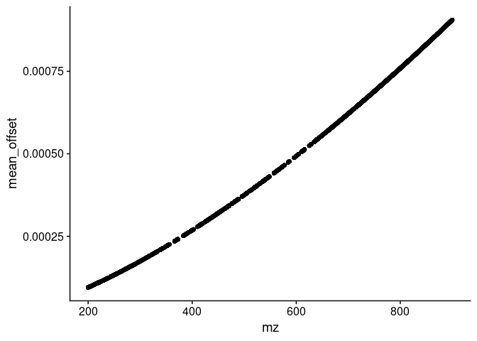
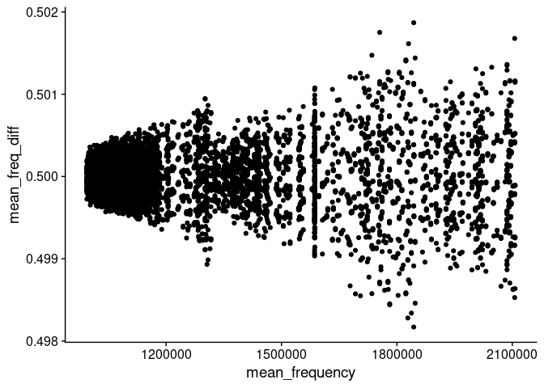
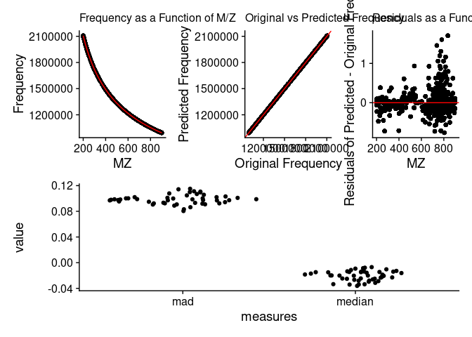
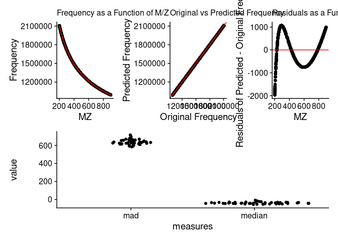
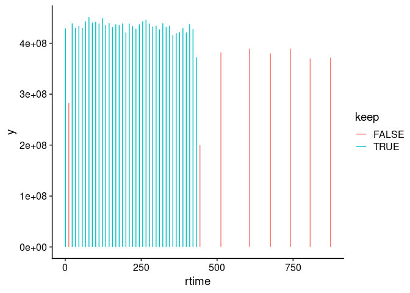

<!-- README.md is generated from README.Rmd. Please edit that file -->

# ScanCentricPeakCharacterization

The goal of the ScanCentricPeakCharacterization package is to facilitate
scan-centric, frequency based, peak characterization of profile level,
multi-scan, direct-injection Fourier-transform mass spectrometry data.

You can read more about the merits of this scan-centric method in:

RM Flight, JM Mitchell & HNB Moseley, “Scan-Centric, Frequency-Based
Method for Characterizing Peaks from Direct Injection Fourier transform
Mass Spectrometry Experiments”, bioRxiv, doi:
<https://doi.org/10.1101/2022.04.14.488423>

## License

This package is licensed with a [BSD-like license](LICENSE.md) with a
4th clause: **No commercial use.**

Academics who want to use it at their institution, please try it.

If you are at a business / for-profit and want to use it, please contact
the authors (Robert Flight, rflight79 at gmail; Hunter Moseley, hunter
dot moseley at gmail) about licensing. Please contact us even if you
aren’t sure what would be required for licensing, we do want people to
use it.

## Installation

You can install ScanCentricPeakCharacterization from
[GitHub](https://github.com/) with:

``` r
# install.packages("remotes")
remotes::install_github("MoseleyBioinformaticsLab/ScanCentricPeakCharacterization")
```

## Documentation Site

You can browse the documentation online
[here](https://moseleybioinformaticslab.github.io/ScanCentricPeakCharacterization).

## Setup

``` r
library(ScanCentricPeakCharacterization)
library(dplyr)
library(patchwork)
library(ggplot2)
theme_set(cowplot::theme_cowplot())
```

## Theory

### Converting m/z to Frequency

Outside of the scan-centric nature of this peak-characterization, the
second most important feature is the conversion from m/z to frequency.
This is done to make evenly spaced data. If you acquire Orbitrap / ICR
type mass spectrometry data over any decent range, there is an
increasing spacing between individual m/z points.

We will load up an example direct-injection lipidomics sample acquired
on a Thermo-Fisher Fusion instrument to demonstrate.

``` r
mzml_lipid = SCMzml$new(system.file("extdata/lipid_example.mzML", package = "ScanCentricPeakCharacterization"))
mzml_lipid$extract_mzml_data()
mzml_lipid$predict_frequency()
```

``` r
mzml_lipid$mzml_df_data[[1]] %>%
  dplyr::filter(convertable) %>%
  ggplot(aes(x = mz, y = mean_offset)) +
  geom_point()
```



We can see here that the difference or offset of m/z points is
increasing with m/z.

In contrast, frequency is defined as the difference over m/z, and
therefore is constant.

")


``` r
mzml_lipid$mzml_df_data[[1]] %>%
  dplyr::filter(convertable) %>%
  ggplot(aes(x = mean_frequency, y = mean_freq_diff)) +
  geom_point()
```



However, we can more generally define the conversion of m/z to frequency
using a linear model of the form:

![frequency = a + \\frac{y}{\\sqrt{mz}} + \\frac{z}{\\sqrt\[3\]{mz}}](https://latex.codecogs.com/png.image?%5Cdpi%7B110%7D&space;%5Cbg_white&space;frequency%20%3D%20a%20%2B%20%5Cfrac%7By%7D%7B%5Csqrt%7Bmz%7D%7D%20%2B%20%5Cfrac%7Bz%7D%7B%5Csqrt%5B3%5D%7Bmz%7D%7D "frequency = a + \frac{y}{\sqrt{mz}} + \frac{z}{\sqrt[3]{mz}}")

And we can verify that with a plot of the m/z vs frequency and their
predicted values, in a couple of ways, as well as a plot of the
residuals.

``` r
mzml_lipid$check_frequency_model()
```


See the example of `SCRaw` below to see how we can change the model
being used.

## Basic Objects and Classes

### SCCharacterizePeaks

`SCCharacterizePeaks` controls the overall interplay between:

-   the `SCZip` container that will hold the original and final data;
-   the `SCMzml` object that loads mzml data, transforms it to frequency
    space, and filters out scans that don’t seem to belong;
-   the `SCPeakRegion` and `SCPeakRegionFinder` that actually do all of
    the peak characterization.

It also has the ability to do the first preparation steps of the data
and check that the frequency model is appropriate.

Let’s give an example using an example lipid file.

``` r
lipid_sample = system.file("extdata", "lipid_example.mzML", package = "ScanCentricPeakCharacterization")
sc_char = SCCharacterizePeaks$new(lipid_sample, out_file = here::here("lipid_sample.zip"))

sc_char$load_file()
sc_char$prepare_mzml_data()
```

#### Check Frequency Model

And now we can check that our frequency model should work for the rest
of the steps.

``` r
sc_char$check_frequency_model()
```



If the frequency model was wrong, then we should instantiate a new one
with a different model.

``` r
freq_model = c("a.freq" = 0, "x.freq" = -1, "y.freq" = -1/2, "z.freq" = -1/3)
freq_model2 = c("a.freq" = 0, "x.freq" = -1, "y.freq" = -1/3)

sc_char$set_frequency_fit_description(freq_model2)
sc_char$predict_frequency()

sc_char$check_frequency_model()
```



This model is definitely incorrect. We can see this from the plot of
residuals by m/z, and the MAD (median absolute deviations) and median
differences of the residuals across the scans are very, very high.

``` r
sc_char$set_frequency_fit_description(freq_model)
sc_char$predict_frequency()
```

#### Check Scans Kept

We can also check which peaks were excluded by examining the `scan_info`
data.frame.

``` r
scan_info = sc_char$scan_info()
head(scan_info)
#>   scanIndex scan polarity      rtime       tic rtime_lag rtime_lead rtime_keep y_freq_keep
#> 1         1 s.01        1  0.8358959 429046848        NA   11.06028       TRUE        TRUE
#> 2         2 s.02        1 11.8961766 282278784  11.06028   11.07281       TRUE        TRUE
#> 3         3 s.03        1 22.9689818 439026304  11.07281   11.04548       TRUE        TRUE
#> 4         4 s.04        1 34.0144615 429789920  11.04548   11.04705       TRUE        TRUE
#> 5         5 s.05        1 45.0615118 433693216  11.04705   11.04636       TRUE        TRUE
#> 6         6 s.06        1 56.1078670 429844288  11.04636   11.04656       TRUE        TRUE
#>   stats_keep keep        mad      median    a.freq   x.freq   y.freq   z.freq        a.mz      x.mz
#> 1       TRUE TRUE 0.09488578 -0.01991055 -36.29313 4339.548 29800864 1070.974 0.003203856 -19081.56
#> 2       TRUE TRUE 0.11431756 -0.02607351 -42.73811 5607.854 29800327 1289.635 0.003874297 -22330.45
#> 3       TRUE TRUE 0.08638029 -0.01477036 -37.93255 4734.174 29800719 1129.750 0.002996038 -18154.25
#> 4       TRUE TRUE 0.09700394 -0.03144327 -37.61949 4656.438 29800744 1119.253 0.004465065 -24589.24
#> 5       TRUE TRUE 0.08886880 -0.01449103 -35.80378 4281.555 29800892 1056.818 0.003222591 -19116.27
#> 6       TRUE TRUE 0.10315704 -0.01284821 -41.00362 5388.045 29800458 1236.099 0.004144753 -23243.80
#>           y.mz          z.mz
#> 1 8.882685e+14 -1.900395e+16
#> 2 8.882729e+14 -2.130416e+16
#> 3 8.882673e+14 -1.836750e+16
#> 4 8.882763e+14 -2.247840e+16
#> 5 8.882683e+14 -1.894065e+16
#> 6 8.882745e+14 -2.166934e+16

scan_info %>%
  ggplot(aes(x = rtime, xend = rtime, y = 0, yend = tic, color = keep)) +
  geom_segment()
```



We can see that several scans were excluded by being too high in their
retention time (rtime), and then two were outliers based on the
statistics of the frequency square root coefficient.

If this isn’t doing what we want, we can define a different
scan-filtering function that does more along the lines of what we want.
See the documentation about `add_scan_info()` using `?add_scan_info` to
see what is generally available.

#### Run Peak Characterization

Once we are happy with how we have set up the `SCCharacterizePeaks`
object, we can run the peak characterization.

``` r
# not run
sc_char$find_peaks()
```

#### Run Everything

If you’ve already examined the model, and have your function for
filtering scans all set up, then you can run everything on your sample
rather quickly using this simple command:

``` r
# not run
sc_char = SCCharacterizePeaks$new("file.mzML", out_file = "file.zip")
sc_char$run_all()
```

### SCMzml

`SCMzml` is responsible for loading the raw data, holding per-scan
metadata, extracting the scan-level m/z and intensity, converting them
to frequency, and filtering any scans out. Although the user should not
have to interact with it much, and **normally** it is controlled by
`SCCharacterizePeaks`, we mention it here so that the user knows it
exists.

### SCPeakRegionFinder

`SCPeakRegionFinder` is similar to `SCCharacterizePeaks` in that it is
more of a controlling workflow object. It serves to coordinate all the
steps that need to happen for peak characterization outside of the
conversion to frequency, which is the purview of the `SCMzml` object.
The `SCPeakRegionFinder` acts on the `SCPeakRegions` object, which has
all of the data and methods.

### SCPeakRegions

`SCPeakRegions` holds the frequency data and the methods. It is
controlled by `SCPeakRegionFinder`.

### SCZip

We wanted a fairly generic way to store the original mzML file, any
metadata generated about it, the binary output of `SCPeakRegionFinder`,
and a JSONized peak list that can be used for assignment. What we
decided on was a simple zip file that keeps those objects together. When
we create a new `SCZip`, we actually create a temp directory, and move
all the data there, and unzip it so that it is easily accessible and
pieces can be modified easily.
