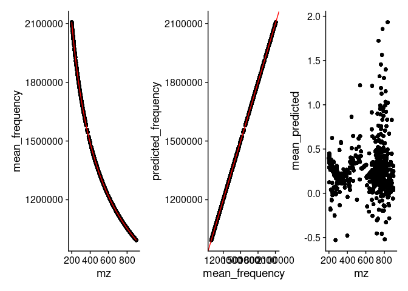
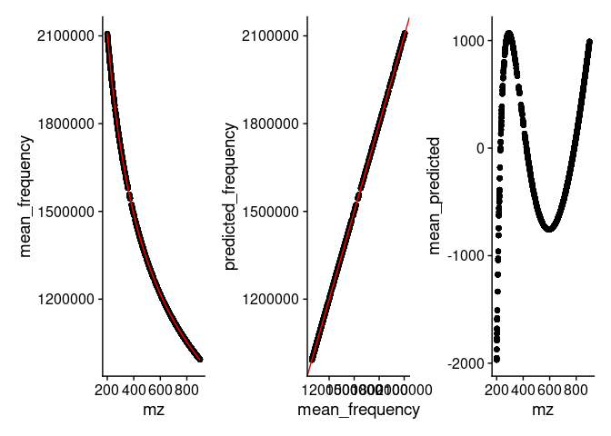

<!-- README.md is generated from README.Rmd. Please edit that file -->

# FTMS.peakCharacterization

The goal of the FTMS.peakCharacterization package is to facilitate
scan-centric peak characterization of profile level, multi-scan,
direct-injection Fourier-transform mass spectrometry data.

You can read more about the merits of this scan-centric method in:

RM Flight, JM Mitchell & HNB Moseley, “Scan-Centric, Frequency-Based
Method for Characterizing Peaks from Direct Injection Fourier transform
Mass Spectrometry Experiments”, bioRxiv, doi:
<https://doi.org/10.1101/2022.04.14.488423>

## License

This package is licensed with a [BSD-like license](LICENSE.md) with a
4th clause: No commercial use.

Academics who want to use it at their institution, please try it.

If you are at a business / for-profit and want to use it, please contact
the authors about licensing. Please contact us even if you aren’t sure
what would be required for licensing, we do want people to use it.

## Installation

You can install FTMS.peakCharacterization from
[GitHub](https://github.com/) with:

``` r
# install.packages("remotes")
remotes::install_github("MoseleyBioinformaticsLab/FTMS.peakCharacterization")
```

## Theory

### Converting m/z to Frequency

Outside of the scan-centric nature of this peak-characterization, the
second most important feature is the conversion from m/z to frequency.
This is done to make evenly spaced data. If you acquire Orbitrap / ICR
type mass spectrometry data over any decent range, their is an
increasing spacing between individual m/z points.

We will load up an example direct-injection lipidomics sample acquired
on a Thermo-Fisher Fusion instrument to demonstrate.

``` r
raw_lipid = RawMS$new(system.file("extdata/lipid_example.mzML", package = "FTMS.peakCharacterization"))
raw_lipid$extract_raw_data()
raw_lipid$predict_frequency()
```

``` r
raw_lipid$raw_df_data[[1]] %>%
  dplyr::filter(convertable) %>%
  ggplot(aes(x = mz, y = mean_offset)) +
  geom_point()
```


We can see here that the difference or offset of m/z points is
increasing with m/z.

In contrast, frequency is defined as the difference over m/z, and
therefore is constant.

")


``` r
raw_lipid$raw_df_data[[1]] %>%
  dplyr::filter(convertable) %>%
  ggplot(aes(x = mean_frequency, y = mean_freq_diff)) +
  geom_point()
```


However, we can more generally define the conversion of m/z to frequency
using a linear model of the form:

![frequency = a + \\frac{y}{\\sqrt{mz}} + \\frac{z}{\\sqrt\[3\]{mz}}](https://latex.codecogs.com/png.image?%5Cdpi%7B110%7D&space;%5Cbg_white&space;frequency%20%3D%20a%20%2B%20%5Cfrac%7By%7D%7B%5Csqrt%7Bmz%7D%7D%20%2B%20%5Cfrac%7Bz%7D%7B%5Csqrt%5B3%5D%7Bmz%7D%7D "frequency = a + \frac{y}{\sqrt{mz}} + \frac{z}{\sqrt[3]{mz}}")

And we can verify that with a plot of the m/z vs frequency and their
predicted values, in a couple of ways, as well as a plot of the
residuals.

``` r
raw_lipid$check_frequency_model()
```


See the example of `RawMS` below to see how we can change the model
being used.

## Example

We are lacking basic examples at the moment. We are hoping to get some
basic example and more documentation of the functionality in here
shortly.

## Basic Objects and Classes

### RawMS

`RawMS` is responsible for loading the raw data, holding per-scan
metadata, extracting the scan-level m/z and intensity, converting them
to frequency, and filtering any scans out. Although the user should not
have to interact with it much, and **normally** it is controlled by
`CharacterizeMS`, we cover it first here b/c it is useful to instantiate
it at least once per experiment and verify the scan filtering conditions
and the model for converting m/z to frequency.

The default frequency \~ mz model is defined as:

![frequency = a + \\frac{y}{\\sqrt{mz}} + \\frac{z}{\\sqrt\[3\]{mz}}](https://latex.codecogs.com/png.image?%5Cdpi%7B110%7D&space;%5Cbg_white&space;frequency%20%3D%20a%20%2B%20%5Cfrac%7By%7D%7B%5Csqrt%7Bmz%7D%7D%20%2B%20%5Cfrac%7Bz%7D%7B%5Csqrt%5B3%5D%7Bmz%7D%7D "frequency = a + \frac{y}{\sqrt{mz}} + \frac{z}{\sqrt[3]{mz}}")

We encode this using the vector:

``` r
freq_vector = c("a.freq" = 0, "y.freq" = -1/2, "z.freq" = -1/3)
freq_vector
#>     a.freq     y.freq     z.freq 
#>  0.0000000 -0.5000000 -0.3333333
```

We can see how this corresponds to the equation above if we transform
the equation to be like this:


Here we use the **-** to define that it should be a fraction, and the
**1/2** exponent corresponds to the square root.

This is the **default model** that `RawMS` is instantiated with. But
every time you work with a new dataset, you should verify the model
being used is appropriate.

``` r
lipid_1 = RawMS$new(system.file("extdata", "lipid_example.mzML", package = "FTMS.peakCharacterization"))
lipid_1$extract_raw_data()
lipid_1$predict_frequency()

lipid_1$check_frequency_model()
```



So this model looks right.

What if we mis-define the model?


``` r
alt_model = c("a.freq" = 0, "x.freq" = -1, "y.freq" = -1/3)

lipid_2 = RawMS$new(system.file("extdata", "lipid_example.mzML", package = "FTMS.peakCharacterization"),
                    frequency_fit_description = alt_model)
lipid_2$extract_raw_data()
lipid_2$predict_frequency()

lipid_2$check_frequency_model()
```



Here we can see in the residuals (mean\_predicted) that we’ve obviously
mis-defined the model. It’s not obvious from the means vs predictions
that we’ve mis-defined it!
