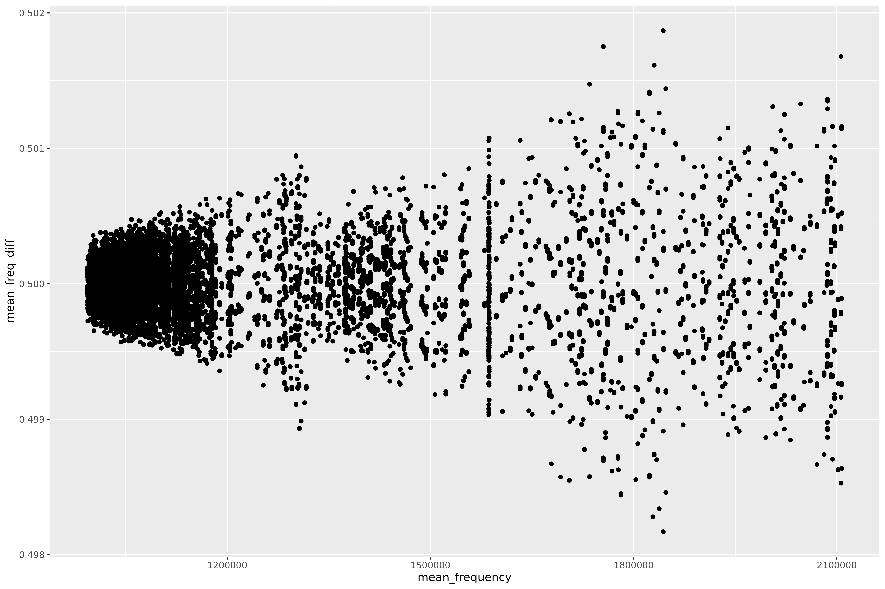

<!-- README.md is generated from README.Rmd. Please edit that file -->

# ScanCentricPeakCharacterization

The goal of the ScanCentricPeakCharacterization (SCPC) package is to
facilitate scan-centric, frequency based, peak characterization of
profile level, multi-scan, direct-injection Fourier-transform mass
spectrometry data.

You can read more about the merits of this scan-centric method in:

RM Flight, JM Mitchell & HNB Moseley, “Scan-Centric, Frequency-Based
Method for Characterizing Peaks from Direct Injection Fourier transform
Mass Spectrometry Experiments”, Metabolites 2022, 12(6), 515;
<https://doi.org/10.3390/metabo12060515>

## License

This package is licensed with a [BSD-like license](LICENSE.md) with a
4th clause: **No commercial use.**

Academics who want to use it at their institution, please try it.

If you are at a business / for-profit and want to use it, please contact
the authors (Robert Flight, rflight79 at gmail; Hunter Moseley, hunter
dot moseley at gmail) about licensing. Please contact us even if you
aren’t sure what would be required for licensing, we do want people to
use it.

## Installation

You can install SCPC from [GitHub](https://github.com/) with:

``` r
# install.packages("remotes")
remotes::install_github("MoseleyBioinformaticsLab/ScanCentricPeakCharacterization")
```

## Documentation Site

You can browse the documentation online
[here](https://moseleybioinformaticslab.github.io/ScanCentricPeakCharacterization).

## Setup

``` r
library(ScanCentricPeakCharacterization)
library(dplyr)
library(patchwork)
library(ggplot2)
#theme_set(cowplot::theme_cowplot())
```

## Theory

### Converting m/z to Frequency

Outside of the scan-centric nature of this peak-characterization, the
second most important feature is the conversion from m/z to frequency.
This is done to make evenly spaced data. If you acquire Orbitrap / ICR
type mass spectrometry data over any decent range, there is an
increasing spacing between individual m/z points.

We will load up an example direct-injection lipidomics sample acquired
on a Thermo-Fisher Fusion instrument to demonstrate.

``` r
mzml_lipid = SCMzml$new(system.file("extdata/lipid_example.mzML", package = "ScanCentricPeakCharacterization"))
mzml_lipid$extract_mzml_data()
mzml_lipid$predict_frequency()
```

``` r
mzml_lipid$mzml_df_data[[1]] %>%
  dplyr::filter(convertable) %>%
  ggplot(aes(x = mz, y = mean_offset)) +
  geom_point()
```


We can see here that the difference or offset of m/z points is
increasing with m/z.

In contrast, frequency is defined as the difference over m/z, and
therefore is constant.

$$mz_{mean} = mean(mz_{p1}, mz_{p2})$$

$$mz_{diff} = mz_{p2} - mz_{p1}$$

$$frequency = \frac{mz_{mean}}{mz_{diff}}$$

``` r
mzml_lipid$mzml_df_data[[1]] %>%
  dplyr::filter(convertable) %>%
  ggplot(aes(x = mean_frequency, y = mean_freq_diff)) +
  geom_point()
```



However, we can more generally define the conversion of m/z to frequency
using a linear model of the form:

$$frequency = a + \frac{x}{mz} +  \frac{y}{\sqrt{mz}} + \frac{z}{\sqrt[3]{mz}}$$

And we can verify that with a plot of the m/z vs frequency and their
predicted values, in a couple of ways, as well as a plot of the
residuals.

``` r
mzml_lipid$check_frequency_model()
```


See the example of `SCMzml` below to see how we can change the model
being used.

## Basic Objects and Classes

A note about the assumptions baked into SCPC:

- Data is acquired in multiple, direct-injection scans (i.e. there is no
  chromatography component).
- The scans are not aggregated together.
- The data is in **profile mode**, not centroided.
- The M/Z range for each scan is identical.
- The data is in an open format supported by `MSnbase` and `mzR`.

### SCMzml

We assume `mzML` is the most likely mass-spectrometer format, and
`SCMzml` is an R6 container around the `mzML` file (although it should
work with **any** of the formats supported by `MSnbase`). It has basic
functionality for loading the `mzML` data using `MSnbase`, filtering out
scans that are not required, and converting the M/Z to frequency space
for subsequent peak detection.

It is good to check a few samples using `SCMzml` before peak
characterization. This is especially important if you need to define
custom scan filtering and choosing a single frequency model before
attempting full peak characterization.

Let’s go through some of it using the example file included with SCPC.
This sample is a lipidomics sample acquired on a Thermo-Fisher tribrid
Orbitrap Fusion over 15 minutes, with a combination of MS1 and MS2
scans, acquired in profile mode. It has been filtered to a subset of M/Z
and total scans to save space. The first 7.5 minutes are the MS1 primary
scans, and the remaining 7.5 minutes are combination of MS1 and MS2
scans of the highest intensity M/Z in the MS1 primary scans.

#### Load the Data

``` r
lipid_sample = system.file("extdata", "lipid_example.mzML", package = "ScanCentricPeakCharacterization")
sc_mzml = SCMzml$new(lipid_sample)
```

After instantiating the object, we extract the data into a list of
data.frames that make it easier to work with. This may change over time
to use more efficient data structures.

``` r
sc_mzml$extract_mzml_data()
```

#### Examine the Scan Level Information

We can see what is reported at the scan level:

``` r
head(sc_mzml$scan_info) |>
  gt::gt()
```

<div id="pzqvgfeyfc" style="padding-left:0px;padding-right:0px;padding-top:10px;padding-bottom:10px;overflow-x:auto;overflow-y:auto;width:auto;height:auto;">
<style>#pzqvgfeyfc table {
  font-family: system-ui, 'Segoe UI', Roboto, Helvetica, Arial, sans-serif, 'Apple Color Emoji', 'Segoe UI Emoji', 'Segoe UI Symbol', 'Noto Color Emoji';
  -webkit-font-smoothing: antialiased;
  -moz-osx-font-smoothing: grayscale;
}
&#10;#pzqvgfeyfc thead, #pzqvgfeyfc tbody, #pzqvgfeyfc tfoot, #pzqvgfeyfc tr, #pzqvgfeyfc td, #pzqvgfeyfc th {
  border-style: none;
}
&#10;#pzqvgfeyfc p {
  margin: 0;
  padding: 0;
}
&#10;#pzqvgfeyfc .gt_table {
  display: table;
  border-collapse: collapse;
  line-height: normal;
  margin-left: auto;
  margin-right: auto;
  color: #333333;
  font-size: 16px;
  font-weight: normal;
  font-style: normal;
  background-color: #FFFFFF;
  width: auto;
  border-top-style: solid;
  border-top-width: 2px;
  border-top-color: #A8A8A8;
  border-right-style: none;
  border-right-width: 2px;
  border-right-color: #D3D3D3;
  border-bottom-style: solid;
  border-bottom-width: 2px;
  border-bottom-color: #A8A8A8;
  border-left-style: none;
  border-left-width: 2px;
  border-left-color: #D3D3D3;
}
&#10;#pzqvgfeyfc .gt_caption {
  padding-top: 4px;
  padding-bottom: 4px;
}
&#10;#pzqvgfeyfc .gt_title {
  color: #333333;
  font-size: 125%;
  font-weight: initial;
  padding-top: 4px;
  padding-bottom: 4px;
  padding-left: 5px;
  padding-right: 5px;
  border-bottom-color: #FFFFFF;
  border-bottom-width: 0;
}
&#10;#pzqvgfeyfc .gt_subtitle {
  color: #333333;
  font-size: 85%;
  font-weight: initial;
  padding-top: 3px;
  padding-bottom: 5px;
  padding-left: 5px;
  padding-right: 5px;
  border-top-color: #FFFFFF;
  border-top-width: 0;
}
&#10;#pzqvgfeyfc .gt_heading {
  background-color: #FFFFFF;
  text-align: center;
  border-bottom-color: #FFFFFF;
  border-left-style: none;
  border-left-width: 1px;
  border-left-color: #D3D3D3;
  border-right-style: none;
  border-right-width: 1px;
  border-right-color: #D3D3D3;
}
&#10;#pzqvgfeyfc .gt_bottom_border {
  border-bottom-style: solid;
  border-bottom-width: 2px;
  border-bottom-color: #D3D3D3;
}
&#10;#pzqvgfeyfc .gt_col_headings {
  border-top-style: solid;
  border-top-width: 2px;
  border-top-color: #D3D3D3;
  border-bottom-style: solid;
  border-bottom-width: 2px;
  border-bottom-color: #D3D3D3;
  border-left-style: none;
  border-left-width: 1px;
  border-left-color: #D3D3D3;
  border-right-style: none;
  border-right-width: 1px;
  border-right-color: #D3D3D3;
}
&#10;#pzqvgfeyfc .gt_col_heading {
  color: #333333;
  background-color: #FFFFFF;
  font-size: 100%;
  font-weight: normal;
  text-transform: inherit;
  border-left-style: none;
  border-left-width: 1px;
  border-left-color: #D3D3D3;
  border-right-style: none;
  border-right-width: 1px;
  border-right-color: #D3D3D3;
  vertical-align: bottom;
  padding-top: 5px;
  padding-bottom: 6px;
  padding-left: 5px;
  padding-right: 5px;
  overflow-x: hidden;
}
&#10;#pzqvgfeyfc .gt_column_spanner_outer {
  color: #333333;
  background-color: #FFFFFF;
  font-size: 100%;
  font-weight: normal;
  text-transform: inherit;
  padding-top: 0;
  padding-bottom: 0;
  padding-left: 4px;
  padding-right: 4px;
}
&#10;#pzqvgfeyfc .gt_column_spanner_outer:first-child {
  padding-left: 0;
}
&#10;#pzqvgfeyfc .gt_column_spanner_outer:last-child {
  padding-right: 0;
}
&#10;#pzqvgfeyfc .gt_column_spanner {
  border-bottom-style: solid;
  border-bottom-width: 2px;
  border-bottom-color: #D3D3D3;
  vertical-align: bottom;
  padding-top: 5px;
  padding-bottom: 5px;
  overflow-x: hidden;
  display: inline-block;
  width: 100%;
}
&#10;#pzqvgfeyfc .gt_spanner_row {
  border-bottom-style: hidden;
}
&#10;#pzqvgfeyfc .gt_group_heading {
  padding-top: 8px;
  padding-bottom: 8px;
  padding-left: 5px;
  padding-right: 5px;
  color: #333333;
  background-color: #FFFFFF;
  font-size: 100%;
  font-weight: initial;
  text-transform: inherit;
  border-top-style: solid;
  border-top-width: 2px;
  border-top-color: #D3D3D3;
  border-bottom-style: solid;
  border-bottom-width: 2px;
  border-bottom-color: #D3D3D3;
  border-left-style: none;
  border-left-width: 1px;
  border-left-color: #D3D3D3;
  border-right-style: none;
  border-right-width: 1px;
  border-right-color: #D3D3D3;
  vertical-align: middle;
  text-align: left;
}
&#10;#pzqvgfeyfc .gt_empty_group_heading {
  padding: 0.5px;
  color: #333333;
  background-color: #FFFFFF;
  font-size: 100%;
  font-weight: initial;
  border-top-style: solid;
  border-top-width: 2px;
  border-top-color: #D3D3D3;
  border-bottom-style: solid;
  border-bottom-width: 2px;
  border-bottom-color: #D3D3D3;
  vertical-align: middle;
}
&#10;#pzqvgfeyfc .gt_from_md > :first-child {
  margin-top: 0;
}
&#10;#pzqvgfeyfc .gt_from_md > :last-child {
  margin-bottom: 0;
}
&#10;#pzqvgfeyfc .gt_row {
  padding-top: 8px;
  padding-bottom: 8px;
  padding-left: 5px;
  padding-right: 5px;
  margin: 10px;
  border-top-style: solid;
  border-top-width: 1px;
  border-top-color: #D3D3D3;
  border-left-style: none;
  border-left-width: 1px;
  border-left-color: #D3D3D3;
  border-right-style: none;
  border-right-width: 1px;
  border-right-color: #D3D3D3;
  vertical-align: middle;
  overflow-x: hidden;
}
&#10;#pzqvgfeyfc .gt_stub {
  color: #333333;
  background-color: #FFFFFF;
  font-size: 100%;
  font-weight: initial;
  text-transform: inherit;
  border-right-style: solid;
  border-right-width: 2px;
  border-right-color: #D3D3D3;
  padding-left: 5px;
  padding-right: 5px;
}
&#10;#pzqvgfeyfc .gt_stub_row_group {
  color: #333333;
  background-color: #FFFFFF;
  font-size: 100%;
  font-weight: initial;
  text-transform: inherit;
  border-right-style: solid;
  border-right-width: 2px;
  border-right-color: #D3D3D3;
  padding-left: 5px;
  padding-right: 5px;
  vertical-align: top;
}
&#10;#pzqvgfeyfc .gt_row_group_first td {
  border-top-width: 2px;
}
&#10;#pzqvgfeyfc .gt_row_group_first th {
  border-top-width: 2px;
}
&#10;#pzqvgfeyfc .gt_summary_row {
  color: #333333;
  background-color: #FFFFFF;
  text-transform: inherit;
  padding-top: 8px;
  padding-bottom: 8px;
  padding-left: 5px;
  padding-right: 5px;
}
&#10;#pzqvgfeyfc .gt_first_summary_row {
  border-top-style: solid;
  border-top-color: #D3D3D3;
}
&#10;#pzqvgfeyfc .gt_first_summary_row.thick {
  border-top-width: 2px;
}
&#10;#pzqvgfeyfc .gt_last_summary_row {
  padding-top: 8px;
  padding-bottom: 8px;
  padding-left: 5px;
  padding-right: 5px;
  border-bottom-style: solid;
  border-bottom-width: 2px;
  border-bottom-color: #D3D3D3;
}
&#10;#pzqvgfeyfc .gt_grand_summary_row {
  color: #333333;
  background-color: #FFFFFF;
  text-transform: inherit;
  padding-top: 8px;
  padding-bottom: 8px;
  padding-left: 5px;
  padding-right: 5px;
}
&#10;#pzqvgfeyfc .gt_first_grand_summary_row {
  padding-top: 8px;
  padding-bottom: 8px;
  padding-left: 5px;
  padding-right: 5px;
  border-top-style: double;
  border-top-width: 6px;
  border-top-color: #D3D3D3;
}
&#10;#pzqvgfeyfc .gt_last_grand_summary_row_top {
  padding-top: 8px;
  padding-bottom: 8px;
  padding-left: 5px;
  padding-right: 5px;
  border-bottom-style: double;
  border-bottom-width: 6px;
  border-bottom-color: #D3D3D3;
}
&#10;#pzqvgfeyfc .gt_striped {
  background-color: rgba(128, 128, 128, 0.05);
}
&#10;#pzqvgfeyfc .gt_table_body {
  border-top-style: solid;
  border-top-width: 2px;
  border-top-color: #D3D3D3;
  border-bottom-style: solid;
  border-bottom-width: 2px;
  border-bottom-color: #D3D3D3;
}
&#10;#pzqvgfeyfc .gt_footnotes {
  color: #333333;
  background-color: #FFFFFF;
  border-bottom-style: none;
  border-bottom-width: 2px;
  border-bottom-color: #D3D3D3;
  border-left-style: none;
  border-left-width: 2px;
  border-left-color: #D3D3D3;
  border-right-style: none;
  border-right-width: 2px;
  border-right-color: #D3D3D3;
}
&#10;#pzqvgfeyfc .gt_footnote {
  margin: 0px;
  font-size: 90%;
  padding-top: 4px;
  padding-bottom: 4px;
  padding-left: 5px;
  padding-right: 5px;
}
&#10;#pzqvgfeyfc .gt_sourcenotes {
  color: #333333;
  background-color: #FFFFFF;
  border-bottom-style: none;
  border-bottom-width: 2px;
  border-bottom-color: #D3D3D3;
  border-left-style: none;
  border-left-width: 2px;
  border-left-color: #D3D3D3;
  border-right-style: none;
  border-right-width: 2px;
  border-right-color: #D3D3D3;
}
&#10;#pzqvgfeyfc .gt_sourcenote {
  font-size: 90%;
  padding-top: 4px;
  padding-bottom: 4px;
  padding-left: 5px;
  padding-right: 5px;
}
&#10;#pzqvgfeyfc .gt_left {
  text-align: left;
}
&#10;#pzqvgfeyfc .gt_center {
  text-align: center;
}
&#10;#pzqvgfeyfc .gt_right {
  text-align: right;
  font-variant-numeric: tabular-nums;
}
&#10;#pzqvgfeyfc .gt_font_normal {
  font-weight: normal;
}
&#10;#pzqvgfeyfc .gt_font_bold {
  font-weight: bold;
}
&#10;#pzqvgfeyfc .gt_font_italic {
  font-style: italic;
}
&#10;#pzqvgfeyfc .gt_super {
  font-size: 65%;
}
&#10;#pzqvgfeyfc .gt_footnote_marks {
  font-size: 75%;
  vertical-align: 0.4em;
  position: initial;
}
&#10;#pzqvgfeyfc .gt_asterisk {
  font-size: 100%;
  vertical-align: 0;
}
&#10;#pzqvgfeyfc .gt_indent_1 {
  text-indent: 5px;
}
&#10;#pzqvgfeyfc .gt_indent_2 {
  text-indent: 10px;
}
&#10;#pzqvgfeyfc .gt_indent_3 {
  text-indent: 15px;
}
&#10;#pzqvgfeyfc .gt_indent_4 {
  text-indent: 20px;
}
&#10;#pzqvgfeyfc .gt_indent_5 {
  text-indent: 25px;
}
</style>
<table class="gt_table" data-quarto-disable-processing="false" data-quarto-bootstrap="false">
  <thead>
    &#10;    <tr class="gt_col_headings">
      <th class="gt_col_heading gt_columns_bottom_border gt_right" rowspan="1" colspan="1" scope="col" id="scanIndex">scanIndex</th>
      <th class="gt_col_heading gt_columns_bottom_border gt_left" rowspan="1" colspan="1" scope="col" id="scan">scan</th>
      <th class="gt_col_heading gt_columns_bottom_border gt_right" rowspan="1" colspan="1" scope="col" id="polarity">polarity</th>
      <th class="gt_col_heading gt_columns_bottom_border gt_right" rowspan="1" colspan="1" scope="col" id="rtime">rtime</th>
      <th class="gt_col_heading gt_columns_bottom_border gt_right" rowspan="1" colspan="1" scope="col" id="tic">tic</th>
      <th class="gt_col_heading gt_columns_bottom_border gt_right" rowspan="1" colspan="1" scope="col" id="rtime_lag">rtime_lag</th>
      <th class="gt_col_heading gt_columns_bottom_border gt_right" rowspan="1" colspan="1" scope="col" id="rtime_lead">rtime_lead</th>
    </tr>
  </thead>
  <tbody class="gt_table_body">
    <tr><td headers="scanIndex" class="gt_row gt_right">1</td>
<td headers="scan" class="gt_row gt_left">s.01</td>
<td headers="polarity" class="gt_row gt_right">1</td>
<td headers="rtime" class="gt_row gt_right">0.8358959</td>
<td headers="tic" class="gt_row gt_right">429046848</td>
<td headers="rtime_lag" class="gt_row gt_right">NA</td>
<td headers="rtime_lead" class="gt_row gt_right">11.06028</td></tr>
    <tr><td headers="scanIndex" class="gt_row gt_right">2</td>
<td headers="scan" class="gt_row gt_left">s.02</td>
<td headers="polarity" class="gt_row gt_right">1</td>
<td headers="rtime" class="gt_row gt_right">11.8961766</td>
<td headers="tic" class="gt_row gt_right">282278784</td>
<td headers="rtime_lag" class="gt_row gt_right">11.06028</td>
<td headers="rtime_lead" class="gt_row gt_right">11.07281</td></tr>
    <tr><td headers="scanIndex" class="gt_row gt_right">3</td>
<td headers="scan" class="gt_row gt_left">s.03</td>
<td headers="polarity" class="gt_row gt_right">1</td>
<td headers="rtime" class="gt_row gt_right">22.9689818</td>
<td headers="tic" class="gt_row gt_right">439026304</td>
<td headers="rtime_lag" class="gt_row gt_right">11.07281</td>
<td headers="rtime_lead" class="gt_row gt_right">11.04548</td></tr>
    <tr><td headers="scanIndex" class="gt_row gt_right">4</td>
<td headers="scan" class="gt_row gt_left">s.04</td>
<td headers="polarity" class="gt_row gt_right">1</td>
<td headers="rtime" class="gt_row gt_right">34.0144615</td>
<td headers="tic" class="gt_row gt_right">429789920</td>
<td headers="rtime_lag" class="gt_row gt_right">11.04548</td>
<td headers="rtime_lead" class="gt_row gt_right">11.04705</td></tr>
    <tr><td headers="scanIndex" class="gt_row gt_right">5</td>
<td headers="scan" class="gt_row gt_left">s.05</td>
<td headers="polarity" class="gt_row gt_right">1</td>
<td headers="rtime" class="gt_row gt_right">45.0615118</td>
<td headers="tic" class="gt_row gt_right">433693216</td>
<td headers="rtime_lag" class="gt_row gt_right">11.04705</td>
<td headers="rtime_lead" class="gt_row gt_right">11.04636</td></tr>
    <tr><td headers="scanIndex" class="gt_row gt_right">6</td>
<td headers="scan" class="gt_row gt_left">s.06</td>
<td headers="polarity" class="gt_row gt_right">1</td>
<td headers="rtime" class="gt_row gt_right">56.1078670</td>
<td headers="tic" class="gt_row gt_right">429844288</td>
<td headers="rtime_lag" class="gt_row gt_right">11.04636</td>
<td headers="rtime_lead" class="gt_row gt_right">11.04656</td></tr>
  </tbody>
  &#10;  
</table>
</div>

And in the data.frame created from the mzML data (here is a single
scan):

``` r
head(sc_mzml$mzml_df_data[[1]]) |>
  gt::gt()
```

<div id="hqtqecipsh" style="padding-left:0px;padding-right:0px;padding-top:10px;padding-bottom:10px;overflow-x:auto;overflow-y:auto;width:auto;height:auto;">
<style>#hqtqecipsh table {
  font-family: system-ui, 'Segoe UI', Roboto, Helvetica, Arial, sans-serif, 'Apple Color Emoji', 'Segoe UI Emoji', 'Segoe UI Symbol', 'Noto Color Emoji';
  -webkit-font-smoothing: antialiased;
  -moz-osx-font-smoothing: grayscale;
}
&#10;#hqtqecipsh thead, #hqtqecipsh tbody, #hqtqecipsh tfoot, #hqtqecipsh tr, #hqtqecipsh td, #hqtqecipsh th {
  border-style: none;
}
&#10;#hqtqecipsh p {
  margin: 0;
  padding: 0;
}
&#10;#hqtqecipsh .gt_table {
  display: table;
  border-collapse: collapse;
  line-height: normal;
  margin-left: auto;
  margin-right: auto;
  color: #333333;
  font-size: 16px;
  font-weight: normal;
  font-style: normal;
  background-color: #FFFFFF;
  width: auto;
  border-top-style: solid;
  border-top-width: 2px;
  border-top-color: #A8A8A8;
  border-right-style: none;
  border-right-width: 2px;
  border-right-color: #D3D3D3;
  border-bottom-style: solid;
  border-bottom-width: 2px;
  border-bottom-color: #A8A8A8;
  border-left-style: none;
  border-left-width: 2px;
  border-left-color: #D3D3D3;
}
&#10;#hqtqecipsh .gt_caption {
  padding-top: 4px;
  padding-bottom: 4px;
}
&#10;#hqtqecipsh .gt_title {
  color: #333333;
  font-size: 125%;
  font-weight: initial;
  padding-top: 4px;
  padding-bottom: 4px;
  padding-left: 5px;
  padding-right: 5px;
  border-bottom-color: #FFFFFF;
  border-bottom-width: 0;
}
&#10;#hqtqecipsh .gt_subtitle {
  color: #333333;
  font-size: 85%;
  font-weight: initial;
  padding-top: 3px;
  padding-bottom: 5px;
  padding-left: 5px;
  padding-right: 5px;
  border-top-color: #FFFFFF;
  border-top-width: 0;
}
&#10;#hqtqecipsh .gt_heading {
  background-color: #FFFFFF;
  text-align: center;
  border-bottom-color: #FFFFFF;
  border-left-style: none;
  border-left-width: 1px;
  border-left-color: #D3D3D3;
  border-right-style: none;
  border-right-width: 1px;
  border-right-color: #D3D3D3;
}
&#10;#hqtqecipsh .gt_bottom_border {
  border-bottom-style: solid;
  border-bottom-width: 2px;
  border-bottom-color: #D3D3D3;
}
&#10;#hqtqecipsh .gt_col_headings {
  border-top-style: solid;
  border-top-width: 2px;
  border-top-color: #D3D3D3;
  border-bottom-style: solid;
  border-bottom-width: 2px;
  border-bottom-color: #D3D3D3;
  border-left-style: none;
  border-left-width: 1px;
  border-left-color: #D3D3D3;
  border-right-style: none;
  border-right-width: 1px;
  border-right-color: #D3D3D3;
}
&#10;#hqtqecipsh .gt_col_heading {
  color: #333333;
  background-color: #FFFFFF;
  font-size: 100%;
  font-weight: normal;
  text-transform: inherit;
  border-left-style: none;
  border-left-width: 1px;
  border-left-color: #D3D3D3;
  border-right-style: none;
  border-right-width: 1px;
  border-right-color: #D3D3D3;
  vertical-align: bottom;
  padding-top: 5px;
  padding-bottom: 6px;
  padding-left: 5px;
  padding-right: 5px;
  overflow-x: hidden;
}
&#10;#hqtqecipsh .gt_column_spanner_outer {
  color: #333333;
  background-color: #FFFFFF;
  font-size: 100%;
  font-weight: normal;
  text-transform: inherit;
  padding-top: 0;
  padding-bottom: 0;
  padding-left: 4px;
  padding-right: 4px;
}
&#10;#hqtqecipsh .gt_column_spanner_outer:first-child {
  padding-left: 0;
}
&#10;#hqtqecipsh .gt_column_spanner_outer:last-child {
  padding-right: 0;
}
&#10;#hqtqecipsh .gt_column_spanner {
  border-bottom-style: solid;
  border-bottom-width: 2px;
  border-bottom-color: #D3D3D3;
  vertical-align: bottom;
  padding-top: 5px;
  padding-bottom: 5px;
  overflow-x: hidden;
  display: inline-block;
  width: 100%;
}
&#10;#hqtqecipsh .gt_spanner_row {
  border-bottom-style: hidden;
}
&#10;#hqtqecipsh .gt_group_heading {
  padding-top: 8px;
  padding-bottom: 8px;
  padding-left: 5px;
  padding-right: 5px;
  color: #333333;
  background-color: #FFFFFF;
  font-size: 100%;
  font-weight: initial;
  text-transform: inherit;
  border-top-style: solid;
  border-top-width: 2px;
  border-top-color: #D3D3D3;
  border-bottom-style: solid;
  border-bottom-width: 2px;
  border-bottom-color: #D3D3D3;
  border-left-style: none;
  border-left-width: 1px;
  border-left-color: #D3D3D3;
  border-right-style: none;
  border-right-width: 1px;
  border-right-color: #D3D3D3;
  vertical-align: middle;
  text-align: left;
}
&#10;#hqtqecipsh .gt_empty_group_heading {
  padding: 0.5px;
  color: #333333;
  background-color: #FFFFFF;
  font-size: 100%;
  font-weight: initial;
  border-top-style: solid;
  border-top-width: 2px;
  border-top-color: #D3D3D3;
  border-bottom-style: solid;
  border-bottom-width: 2px;
  border-bottom-color: #D3D3D3;
  vertical-align: middle;
}
&#10;#hqtqecipsh .gt_from_md > :first-child {
  margin-top: 0;
}
&#10;#hqtqecipsh .gt_from_md > :last-child {
  margin-bottom: 0;
}
&#10;#hqtqecipsh .gt_row {
  padding-top: 8px;
  padding-bottom: 8px;
  padding-left: 5px;
  padding-right: 5px;
  margin: 10px;
  border-top-style: solid;
  border-top-width: 1px;
  border-top-color: #D3D3D3;
  border-left-style: none;
  border-left-width: 1px;
  border-left-color: #D3D3D3;
  border-right-style: none;
  border-right-width: 1px;
  border-right-color: #D3D3D3;
  vertical-align: middle;
  overflow-x: hidden;
}
&#10;#hqtqecipsh .gt_stub {
  color: #333333;
  background-color: #FFFFFF;
  font-size: 100%;
  font-weight: initial;
  text-transform: inherit;
  border-right-style: solid;
  border-right-width: 2px;
  border-right-color: #D3D3D3;
  padding-left: 5px;
  padding-right: 5px;
}
&#10;#hqtqecipsh .gt_stub_row_group {
  color: #333333;
  background-color: #FFFFFF;
  font-size: 100%;
  font-weight: initial;
  text-transform: inherit;
  border-right-style: solid;
  border-right-width: 2px;
  border-right-color: #D3D3D3;
  padding-left: 5px;
  padding-right: 5px;
  vertical-align: top;
}
&#10;#hqtqecipsh .gt_row_group_first td {
  border-top-width: 2px;
}
&#10;#hqtqecipsh .gt_row_group_first th {
  border-top-width: 2px;
}
&#10;#hqtqecipsh .gt_summary_row {
  color: #333333;
  background-color: #FFFFFF;
  text-transform: inherit;
  padding-top: 8px;
  padding-bottom: 8px;
  padding-left: 5px;
  padding-right: 5px;
}
&#10;#hqtqecipsh .gt_first_summary_row {
  border-top-style: solid;
  border-top-color: #D3D3D3;
}
&#10;#hqtqecipsh .gt_first_summary_row.thick {
  border-top-width: 2px;
}
&#10;#hqtqecipsh .gt_last_summary_row {
  padding-top: 8px;
  padding-bottom: 8px;
  padding-left: 5px;
  padding-right: 5px;
  border-bottom-style: solid;
  border-bottom-width: 2px;
  border-bottom-color: #D3D3D3;
}
&#10;#hqtqecipsh .gt_grand_summary_row {
  color: #333333;
  background-color: #FFFFFF;
  text-transform: inherit;
  padding-top: 8px;
  padding-bottom: 8px;
  padding-left: 5px;
  padding-right: 5px;
}
&#10;#hqtqecipsh .gt_first_grand_summary_row {
  padding-top: 8px;
  padding-bottom: 8px;
  padding-left: 5px;
  padding-right: 5px;
  border-top-style: double;
  border-top-width: 6px;
  border-top-color: #D3D3D3;
}
&#10;#hqtqecipsh .gt_last_grand_summary_row_top {
  padding-top: 8px;
  padding-bottom: 8px;
  padding-left: 5px;
  padding-right: 5px;
  border-bottom-style: double;
  border-bottom-width: 6px;
  border-bottom-color: #D3D3D3;
}
&#10;#hqtqecipsh .gt_striped {
  background-color: rgba(128, 128, 128, 0.05);
}
&#10;#hqtqecipsh .gt_table_body {
  border-top-style: solid;
  border-top-width: 2px;
  border-top-color: #D3D3D3;
  border-bottom-style: solid;
  border-bottom-width: 2px;
  border-bottom-color: #D3D3D3;
}
&#10;#hqtqecipsh .gt_footnotes {
  color: #333333;
  background-color: #FFFFFF;
  border-bottom-style: none;
  border-bottom-width: 2px;
  border-bottom-color: #D3D3D3;
  border-left-style: none;
  border-left-width: 2px;
  border-left-color: #D3D3D3;
  border-right-style: none;
  border-right-width: 2px;
  border-right-color: #D3D3D3;
}
&#10;#hqtqecipsh .gt_footnote {
  margin: 0px;
  font-size: 90%;
  padding-top: 4px;
  padding-bottom: 4px;
  padding-left: 5px;
  padding-right: 5px;
}
&#10;#hqtqecipsh .gt_sourcenotes {
  color: #333333;
  background-color: #FFFFFF;
  border-bottom-style: none;
  border-bottom-width: 2px;
  border-bottom-color: #D3D3D3;
  border-left-style: none;
  border-left-width: 2px;
  border-left-color: #D3D3D3;
  border-right-style: none;
  border-right-width: 2px;
  border-right-color: #D3D3D3;
}
&#10;#hqtqecipsh .gt_sourcenote {
  font-size: 90%;
  padding-top: 4px;
  padding-bottom: 4px;
  padding-left: 5px;
  padding-right: 5px;
}
&#10;#hqtqecipsh .gt_left {
  text-align: left;
}
&#10;#hqtqecipsh .gt_center {
  text-align: center;
}
&#10;#hqtqecipsh .gt_right {
  text-align: right;
  font-variant-numeric: tabular-nums;
}
&#10;#hqtqecipsh .gt_font_normal {
  font-weight: normal;
}
&#10;#hqtqecipsh .gt_font_bold {
  font-weight: bold;
}
&#10;#hqtqecipsh .gt_font_italic {
  font-style: italic;
}
&#10;#hqtqecipsh .gt_super {
  font-size: 65%;
}
&#10;#hqtqecipsh .gt_footnote_marks {
  font-size: 75%;
  vertical-align: 0.4em;
  position: initial;
}
&#10;#hqtqecipsh .gt_asterisk {
  font-size: 100%;
  vertical-align: 0;
}
&#10;#hqtqecipsh .gt_indent_1 {
  text-indent: 5px;
}
&#10;#hqtqecipsh .gt_indent_2 {
  text-indent: 10px;
}
&#10;#hqtqecipsh .gt_indent_3 {
  text-indent: 15px;
}
&#10;#hqtqecipsh .gt_indent_4 {
  text-indent: 20px;
}
&#10;#hqtqecipsh .gt_indent_5 {
  text-indent: 25px;
}
</style>
<table class="gt_table" data-quarto-disable-processing="false" data-quarto-bootstrap="false">
  <thead>
    &#10;    <tr class="gt_col_headings">
      <th class="gt_col_heading gt_columns_bottom_border gt_right" rowspan="1" colspan="1" scope="col" id="mz">mz</th>
      <th class="gt_col_heading gt_columns_bottom_border gt_right" rowspan="1" colspan="1" scope="col" id="intensity">intensity</th>
      <th class="gt_col_heading gt_columns_bottom_border gt_left" rowspan="1" colspan="1" scope="col" id="scan">scan</th>
      <th class="gt_col_heading gt_columns_bottom_border gt_right" rowspan="1" colspan="1" scope="col" id="scan_index">scan_index</th>
    </tr>
  </thead>
  <tbody class="gt_table_body">
    <tr><td headers="mz" class="gt_row gt_right">200.0614</td>
<td headers="intensity" class="gt_row gt_right">0.000</td>
<td headers="scan" class="gt_row gt_left">s.01</td>
<td headers="scan_index" class="gt_row gt_right">1</td></tr>
    <tr><td headers="mz" class="gt_row gt_right">200.0615</td>
<td headers="intensity" class="gt_row gt_right">0.000</td>
<td headers="scan" class="gt_row gt_left">s.01</td>
<td headers="scan_index" class="gt_row gt_right">1</td></tr>
    <tr><td headers="mz" class="gt_row gt_right">200.0616</td>
<td headers="intensity" class="gt_row gt_right">0.000</td>
<td headers="scan" class="gt_row gt_left">s.01</td>
<td headers="scan_index" class="gt_row gt_right">1</td></tr>
    <tr><td headers="mz" class="gt_row gt_right">200.0617</td>
<td headers="intensity" class="gt_row gt_right">0.000</td>
<td headers="scan" class="gt_row gt_left">s.01</td>
<td headers="scan_index" class="gt_row gt_right">1</td></tr>
    <tr><td headers="mz" class="gt_row gt_right">200.0618</td>
<td headers="intensity" class="gt_row gt_right">3605.357</td>
<td headers="scan" class="gt_row gt_left">s.01</td>
<td headers="scan_index" class="gt_row gt_right">1</td></tr>
    <tr><td headers="mz" class="gt_row gt_right">200.0619</td>
<td headers="intensity" class="gt_row gt_right">9543.890</td>
<td headers="scan" class="gt_row gt_left">s.01</td>
<td headers="scan_index" class="gt_row gt_right">1</td></tr>
  </tbody>
  &#10;  
</table>
</div>

#### Frequency and M/Z Models

As discussed above (see [Theory](#theory)), SCPC is based on the idea
that we should work in a pseudo-frequency space, which is achieved by
calculating an initial frequency based on the M/Z spacing, and then fit
that to a model based on the geometry of the Orbitrap or ICR.

For Thermo Orbitrap (Fusion and Fusion Lumos), that our lab primarily
uses, this model looks like:

$$frequency = a + \frac{x}{mz} +  \frac{y}{\sqrt{mz}} + \frac{z}{\sqrt[3]{mz}}$$

In contrast, for Bruker SolariX, the model has one fewer term:

$$frequency = a + \frac{x}{mz} +  \frac{y}{\sqrt{mz}}$$

Note how these models are encoded, the (-) indicates a fraction, and the
actual fraction indicates a root (either square or cube in these cases):

``` r
# thermo fusion model:
thermo = c("a.freq" = 0, "x.freq" = -1, "y.freq" = -1/2, "z.freq" = -1/3)

# bruker
bruker = c("a.freq" = 0, "x.freq" = -1, "y.freq" = -1/2)
```

``` r
sc_mzml$predict_frequency()
```

Here is the scan information after prediction, it now has model terms
related to the above equations:

``` r
sc_mzml$scan_info |>
  head() |>
  gt::gt()
```

<div id="rcxxjuiwvn" style="padding-left:0px;padding-right:0px;padding-top:10px;padding-bottom:10px;overflow-x:auto;overflow-y:auto;width:auto;height:auto;">
<style>#rcxxjuiwvn table {
  font-family: system-ui, 'Segoe UI', Roboto, Helvetica, Arial, sans-serif, 'Apple Color Emoji', 'Segoe UI Emoji', 'Segoe UI Symbol', 'Noto Color Emoji';
  -webkit-font-smoothing: antialiased;
  -moz-osx-font-smoothing: grayscale;
}
&#10;#rcxxjuiwvn thead, #rcxxjuiwvn tbody, #rcxxjuiwvn tfoot, #rcxxjuiwvn tr, #rcxxjuiwvn td, #rcxxjuiwvn th {
  border-style: none;
}
&#10;#rcxxjuiwvn p {
  margin: 0;
  padding: 0;
}
&#10;#rcxxjuiwvn .gt_table {
  display: table;
  border-collapse: collapse;
  line-height: normal;
  margin-left: auto;
  margin-right: auto;
  color: #333333;
  font-size: 16px;
  font-weight: normal;
  font-style: normal;
  background-color: #FFFFFF;
  width: auto;
  border-top-style: solid;
  border-top-width: 2px;
  border-top-color: #A8A8A8;
  border-right-style: none;
  border-right-width: 2px;
  border-right-color: #D3D3D3;
  border-bottom-style: solid;
  border-bottom-width: 2px;
  border-bottom-color: #A8A8A8;
  border-left-style: none;
  border-left-width: 2px;
  border-left-color: #D3D3D3;
}
&#10;#rcxxjuiwvn .gt_caption {
  padding-top: 4px;
  padding-bottom: 4px;
}
&#10;#rcxxjuiwvn .gt_title {
  color: #333333;
  font-size: 125%;
  font-weight: initial;
  padding-top: 4px;
  padding-bottom: 4px;
  padding-left: 5px;
  padding-right: 5px;
  border-bottom-color: #FFFFFF;
  border-bottom-width: 0;
}
&#10;#rcxxjuiwvn .gt_subtitle {
  color: #333333;
  font-size: 85%;
  font-weight: initial;
  padding-top: 3px;
  padding-bottom: 5px;
  padding-left: 5px;
  padding-right: 5px;
  border-top-color: #FFFFFF;
  border-top-width: 0;
}
&#10;#rcxxjuiwvn .gt_heading {
  background-color: #FFFFFF;
  text-align: center;
  border-bottom-color: #FFFFFF;
  border-left-style: none;
  border-left-width: 1px;
  border-left-color: #D3D3D3;
  border-right-style: none;
  border-right-width: 1px;
  border-right-color: #D3D3D3;
}
&#10;#rcxxjuiwvn .gt_bottom_border {
  border-bottom-style: solid;
  border-bottom-width: 2px;
  border-bottom-color: #D3D3D3;
}
&#10;#rcxxjuiwvn .gt_col_headings {
  border-top-style: solid;
  border-top-width: 2px;
  border-top-color: #D3D3D3;
  border-bottom-style: solid;
  border-bottom-width: 2px;
  border-bottom-color: #D3D3D3;
  border-left-style: none;
  border-left-width: 1px;
  border-left-color: #D3D3D3;
  border-right-style: none;
  border-right-width: 1px;
  border-right-color: #D3D3D3;
}
&#10;#rcxxjuiwvn .gt_col_heading {
  color: #333333;
  background-color: #FFFFFF;
  font-size: 100%;
  font-weight: normal;
  text-transform: inherit;
  border-left-style: none;
  border-left-width: 1px;
  border-left-color: #D3D3D3;
  border-right-style: none;
  border-right-width: 1px;
  border-right-color: #D3D3D3;
  vertical-align: bottom;
  padding-top: 5px;
  padding-bottom: 6px;
  padding-left: 5px;
  padding-right: 5px;
  overflow-x: hidden;
}
&#10;#rcxxjuiwvn .gt_column_spanner_outer {
  color: #333333;
  background-color: #FFFFFF;
  font-size: 100%;
  font-weight: normal;
  text-transform: inherit;
  padding-top: 0;
  padding-bottom: 0;
  padding-left: 4px;
  padding-right: 4px;
}
&#10;#rcxxjuiwvn .gt_column_spanner_outer:first-child {
  padding-left: 0;
}
&#10;#rcxxjuiwvn .gt_column_spanner_outer:last-child {
  padding-right: 0;
}
&#10;#rcxxjuiwvn .gt_column_spanner {
  border-bottom-style: solid;
  border-bottom-width: 2px;
  border-bottom-color: #D3D3D3;
  vertical-align: bottom;
  padding-top: 5px;
  padding-bottom: 5px;
  overflow-x: hidden;
  display: inline-block;
  width: 100%;
}
&#10;#rcxxjuiwvn .gt_spanner_row {
  border-bottom-style: hidden;
}
&#10;#rcxxjuiwvn .gt_group_heading {
  padding-top: 8px;
  padding-bottom: 8px;
  padding-left: 5px;
  padding-right: 5px;
  color: #333333;
  background-color: #FFFFFF;
  font-size: 100%;
  font-weight: initial;
  text-transform: inherit;
  border-top-style: solid;
  border-top-width: 2px;
  border-top-color: #D3D3D3;
  border-bottom-style: solid;
  border-bottom-width: 2px;
  border-bottom-color: #D3D3D3;
  border-left-style: none;
  border-left-width: 1px;
  border-left-color: #D3D3D3;
  border-right-style: none;
  border-right-width: 1px;
  border-right-color: #D3D3D3;
  vertical-align: middle;
  text-align: left;
}
&#10;#rcxxjuiwvn .gt_empty_group_heading {
  padding: 0.5px;
  color: #333333;
  background-color: #FFFFFF;
  font-size: 100%;
  font-weight: initial;
  border-top-style: solid;
  border-top-width: 2px;
  border-top-color: #D3D3D3;
  border-bottom-style: solid;
  border-bottom-width: 2px;
  border-bottom-color: #D3D3D3;
  vertical-align: middle;
}
&#10;#rcxxjuiwvn .gt_from_md > :first-child {
  margin-top: 0;
}
&#10;#rcxxjuiwvn .gt_from_md > :last-child {
  margin-bottom: 0;
}
&#10;#rcxxjuiwvn .gt_row {
  padding-top: 8px;
  padding-bottom: 8px;
  padding-left: 5px;
  padding-right: 5px;
  margin: 10px;
  border-top-style: solid;
  border-top-width: 1px;
  border-top-color: #D3D3D3;
  border-left-style: none;
  border-left-width: 1px;
  border-left-color: #D3D3D3;
  border-right-style: none;
  border-right-width: 1px;
  border-right-color: #D3D3D3;
  vertical-align: middle;
  overflow-x: hidden;
}
&#10;#rcxxjuiwvn .gt_stub {
  color: #333333;
  background-color: #FFFFFF;
  font-size: 100%;
  font-weight: initial;
  text-transform: inherit;
  border-right-style: solid;
  border-right-width: 2px;
  border-right-color: #D3D3D3;
  padding-left: 5px;
  padding-right: 5px;
}
&#10;#rcxxjuiwvn .gt_stub_row_group {
  color: #333333;
  background-color: #FFFFFF;
  font-size: 100%;
  font-weight: initial;
  text-transform: inherit;
  border-right-style: solid;
  border-right-width: 2px;
  border-right-color: #D3D3D3;
  padding-left: 5px;
  padding-right: 5px;
  vertical-align: top;
}
&#10;#rcxxjuiwvn .gt_row_group_first td {
  border-top-width: 2px;
}
&#10;#rcxxjuiwvn .gt_row_group_first th {
  border-top-width: 2px;
}
&#10;#rcxxjuiwvn .gt_summary_row {
  color: #333333;
  background-color: #FFFFFF;
  text-transform: inherit;
  padding-top: 8px;
  padding-bottom: 8px;
  padding-left: 5px;
  padding-right: 5px;
}
&#10;#rcxxjuiwvn .gt_first_summary_row {
  border-top-style: solid;
  border-top-color: #D3D3D3;
}
&#10;#rcxxjuiwvn .gt_first_summary_row.thick {
  border-top-width: 2px;
}
&#10;#rcxxjuiwvn .gt_last_summary_row {
  padding-top: 8px;
  padding-bottom: 8px;
  padding-left: 5px;
  padding-right: 5px;
  border-bottom-style: solid;
  border-bottom-width: 2px;
  border-bottom-color: #D3D3D3;
}
&#10;#rcxxjuiwvn .gt_grand_summary_row {
  color: #333333;
  background-color: #FFFFFF;
  text-transform: inherit;
  padding-top: 8px;
  padding-bottom: 8px;
  padding-left: 5px;
  padding-right: 5px;
}
&#10;#rcxxjuiwvn .gt_first_grand_summary_row {
  padding-top: 8px;
  padding-bottom: 8px;
  padding-left: 5px;
  padding-right: 5px;
  border-top-style: double;
  border-top-width: 6px;
  border-top-color: #D3D3D3;
}
&#10;#rcxxjuiwvn .gt_last_grand_summary_row_top {
  padding-top: 8px;
  padding-bottom: 8px;
  padding-left: 5px;
  padding-right: 5px;
  border-bottom-style: double;
  border-bottom-width: 6px;
  border-bottom-color: #D3D3D3;
}
&#10;#rcxxjuiwvn .gt_striped {
  background-color: rgba(128, 128, 128, 0.05);
}
&#10;#rcxxjuiwvn .gt_table_body {
  border-top-style: solid;
  border-top-width: 2px;
  border-top-color: #D3D3D3;
  border-bottom-style: solid;
  border-bottom-width: 2px;
  border-bottom-color: #D3D3D3;
}
&#10;#rcxxjuiwvn .gt_footnotes {
  color: #333333;
  background-color: #FFFFFF;
  border-bottom-style: none;
  border-bottom-width: 2px;
  border-bottom-color: #D3D3D3;
  border-left-style: none;
  border-left-width: 2px;
  border-left-color: #D3D3D3;
  border-right-style: none;
  border-right-width: 2px;
  border-right-color: #D3D3D3;
}
&#10;#rcxxjuiwvn .gt_footnote {
  margin: 0px;
  font-size: 90%;
  padding-top: 4px;
  padding-bottom: 4px;
  padding-left: 5px;
  padding-right: 5px;
}
&#10;#rcxxjuiwvn .gt_sourcenotes {
  color: #333333;
  background-color: #FFFFFF;
  border-bottom-style: none;
  border-bottom-width: 2px;
  border-bottom-color: #D3D3D3;
  border-left-style: none;
  border-left-width: 2px;
  border-left-color: #D3D3D3;
  border-right-style: none;
  border-right-width: 2px;
  border-right-color: #D3D3D3;
}
&#10;#rcxxjuiwvn .gt_sourcenote {
  font-size: 90%;
  padding-top: 4px;
  padding-bottom: 4px;
  padding-left: 5px;
  padding-right: 5px;
}
&#10;#rcxxjuiwvn .gt_left {
  text-align: left;
}
&#10;#rcxxjuiwvn .gt_center {
  text-align: center;
}
&#10;#rcxxjuiwvn .gt_right {
  text-align: right;
  font-variant-numeric: tabular-nums;
}
&#10;#rcxxjuiwvn .gt_font_normal {
  font-weight: normal;
}
&#10;#rcxxjuiwvn .gt_font_bold {
  font-weight: bold;
}
&#10;#rcxxjuiwvn .gt_font_italic {
  font-style: italic;
}
&#10;#rcxxjuiwvn .gt_super {
  font-size: 65%;
}
&#10;#rcxxjuiwvn .gt_footnote_marks {
  font-size: 75%;
  vertical-align: 0.4em;
  position: initial;
}
&#10;#rcxxjuiwvn .gt_asterisk {
  font-size: 100%;
  vertical-align: 0;
}
&#10;#rcxxjuiwvn .gt_indent_1 {
  text-indent: 5px;
}
&#10;#rcxxjuiwvn .gt_indent_2 {
  text-indent: 10px;
}
&#10;#rcxxjuiwvn .gt_indent_3 {
  text-indent: 15px;
}
&#10;#rcxxjuiwvn .gt_indent_4 {
  text-indent: 20px;
}
&#10;#rcxxjuiwvn .gt_indent_5 {
  text-indent: 25px;
}
</style>
<table class="gt_table" data-quarto-disable-processing="false" data-quarto-bootstrap="false">
  <thead>
    &#10;    <tr class="gt_col_headings">
      <th class="gt_col_heading gt_columns_bottom_border gt_right" rowspan="1" colspan="1" scope="col" id="scanIndex">scanIndex</th>
      <th class="gt_col_heading gt_columns_bottom_border gt_left" rowspan="1" colspan="1" scope="col" id="scan">scan</th>
      <th class="gt_col_heading gt_columns_bottom_border gt_right" rowspan="1" colspan="1" scope="col" id="polarity">polarity</th>
      <th class="gt_col_heading gt_columns_bottom_border gt_right" rowspan="1" colspan="1" scope="col" id="rtime">rtime</th>
      <th class="gt_col_heading gt_columns_bottom_border gt_right" rowspan="1" colspan="1" scope="col" id="tic">tic</th>
      <th class="gt_col_heading gt_columns_bottom_border gt_right" rowspan="1" colspan="1" scope="col" id="rtime_lag">rtime_lag</th>
      <th class="gt_col_heading gt_columns_bottom_border gt_right" rowspan="1" colspan="1" scope="col" id="rtime_lead">rtime_lead</th>
      <th class="gt_col_heading gt_columns_bottom_border gt_right" rowspan="1" colspan="1" scope="col" id="mad">mad</th>
      <th class="gt_col_heading gt_columns_bottom_border gt_right" rowspan="1" colspan="1" scope="col" id="median">median</th>
      <th class="gt_col_heading gt_columns_bottom_border gt_right" rowspan="1" colspan="1" scope="col" id="a.freq">a.freq</th>
      <th class="gt_col_heading gt_columns_bottom_border gt_right" rowspan="1" colspan="1" scope="col" id="x.freq">x.freq</th>
      <th class="gt_col_heading gt_columns_bottom_border gt_right" rowspan="1" colspan="1" scope="col" id="y.freq">y.freq</th>
      <th class="gt_col_heading gt_columns_bottom_border gt_right" rowspan="1" colspan="1" scope="col" id="z.freq">z.freq</th>
      <th class="gt_col_heading gt_columns_bottom_border gt_right" rowspan="1" colspan="1" scope="col" id="a.mz">a.mz</th>
      <th class="gt_col_heading gt_columns_bottom_border gt_right" rowspan="1" colspan="1" scope="col" id="x.mz">x.mz</th>
      <th class="gt_col_heading gt_columns_bottom_border gt_right" rowspan="1" colspan="1" scope="col" id="y.mz">y.mz</th>
      <th class="gt_col_heading gt_columns_bottom_border gt_right" rowspan="1" colspan="1" scope="col" id="z.mz">z.mz</th>
    </tr>
  </thead>
  <tbody class="gt_table_body">
    <tr><td headers="scanIndex" class="gt_row gt_right">1</td>
<td headers="scan" class="gt_row gt_left">s.01</td>
<td headers="polarity" class="gt_row gt_right">1</td>
<td headers="rtime" class="gt_row gt_right">0.8358959</td>
<td headers="tic" class="gt_row gt_right">429046848</td>
<td headers="rtime_lag" class="gt_row gt_right">NA</td>
<td headers="rtime_lead" class="gt_row gt_right">11.06028</td>
<td headers="mad" class="gt_row gt_right">0.09488578</td>
<td headers="median" class="gt_row gt_right">-0.01991055</td>
<td headers="a.freq" class="gt_row gt_right">-36.29313</td>
<td headers="x.freq" class="gt_row gt_right">4339.548</td>
<td headers="y.freq" class="gt_row gt_right">29800864</td>
<td headers="z.freq" class="gt_row gt_right">1070.974</td>
<td headers="a.mz" class="gt_row gt_right">0.003203856</td>
<td headers="x.mz" class="gt_row gt_right">-19081.56</td>
<td headers="y.mz" class="gt_row gt_right">8.882685e+14</td>
<td headers="z.mz" class="gt_row gt_right">-1.900395e+16</td></tr>
    <tr><td headers="scanIndex" class="gt_row gt_right">2</td>
<td headers="scan" class="gt_row gt_left">s.02</td>
<td headers="polarity" class="gt_row gt_right">1</td>
<td headers="rtime" class="gt_row gt_right">11.8961766</td>
<td headers="tic" class="gt_row gt_right">282278784</td>
<td headers="rtime_lag" class="gt_row gt_right">11.06028</td>
<td headers="rtime_lead" class="gt_row gt_right">11.07281</td>
<td headers="mad" class="gt_row gt_right">0.11431756</td>
<td headers="median" class="gt_row gt_right">-0.02607351</td>
<td headers="a.freq" class="gt_row gt_right">-42.73811</td>
<td headers="x.freq" class="gt_row gt_right">5607.854</td>
<td headers="y.freq" class="gt_row gt_right">29800327</td>
<td headers="z.freq" class="gt_row gt_right">1289.635</td>
<td headers="a.mz" class="gt_row gt_right">0.003874297</td>
<td headers="x.mz" class="gt_row gt_right">-22330.45</td>
<td headers="y.mz" class="gt_row gt_right">8.882729e+14</td>
<td headers="z.mz" class="gt_row gt_right">-2.130416e+16</td></tr>
    <tr><td headers="scanIndex" class="gt_row gt_right">3</td>
<td headers="scan" class="gt_row gt_left">s.03</td>
<td headers="polarity" class="gt_row gt_right">1</td>
<td headers="rtime" class="gt_row gt_right">22.9689818</td>
<td headers="tic" class="gt_row gt_right">439026304</td>
<td headers="rtime_lag" class="gt_row gt_right">11.07281</td>
<td headers="rtime_lead" class="gt_row gt_right">11.04548</td>
<td headers="mad" class="gt_row gt_right">0.08638029</td>
<td headers="median" class="gt_row gt_right">-0.01477036</td>
<td headers="a.freq" class="gt_row gt_right">-37.93255</td>
<td headers="x.freq" class="gt_row gt_right">4734.174</td>
<td headers="y.freq" class="gt_row gt_right">29800719</td>
<td headers="z.freq" class="gt_row gt_right">1129.750</td>
<td headers="a.mz" class="gt_row gt_right">0.002996038</td>
<td headers="x.mz" class="gt_row gt_right">-18154.25</td>
<td headers="y.mz" class="gt_row gt_right">8.882673e+14</td>
<td headers="z.mz" class="gt_row gt_right">-1.836750e+16</td></tr>
    <tr><td headers="scanIndex" class="gt_row gt_right">4</td>
<td headers="scan" class="gt_row gt_left">s.04</td>
<td headers="polarity" class="gt_row gt_right">1</td>
<td headers="rtime" class="gt_row gt_right">34.0144615</td>
<td headers="tic" class="gt_row gt_right">429789920</td>
<td headers="rtime_lag" class="gt_row gt_right">11.04548</td>
<td headers="rtime_lead" class="gt_row gt_right">11.04705</td>
<td headers="mad" class="gt_row gt_right">0.09700394</td>
<td headers="median" class="gt_row gt_right">-0.03144327</td>
<td headers="a.freq" class="gt_row gt_right">-37.61949</td>
<td headers="x.freq" class="gt_row gt_right">4656.438</td>
<td headers="y.freq" class="gt_row gt_right">29800744</td>
<td headers="z.freq" class="gt_row gt_right">1119.253</td>
<td headers="a.mz" class="gt_row gt_right">0.004465065</td>
<td headers="x.mz" class="gt_row gt_right">-24589.24</td>
<td headers="y.mz" class="gt_row gt_right">8.882763e+14</td>
<td headers="z.mz" class="gt_row gt_right">-2.247840e+16</td></tr>
    <tr><td headers="scanIndex" class="gt_row gt_right">5</td>
<td headers="scan" class="gt_row gt_left">s.05</td>
<td headers="polarity" class="gt_row gt_right">1</td>
<td headers="rtime" class="gt_row gt_right">45.0615118</td>
<td headers="tic" class="gt_row gt_right">433693216</td>
<td headers="rtime_lag" class="gt_row gt_right">11.04705</td>
<td headers="rtime_lead" class="gt_row gt_right">11.04636</td>
<td headers="mad" class="gt_row gt_right">0.08886880</td>
<td headers="median" class="gt_row gt_right">-0.01449103</td>
<td headers="a.freq" class="gt_row gt_right">-35.80378</td>
<td headers="x.freq" class="gt_row gt_right">4281.555</td>
<td headers="y.freq" class="gt_row gt_right">29800892</td>
<td headers="z.freq" class="gt_row gt_right">1056.818</td>
<td headers="a.mz" class="gt_row gt_right">0.003222591</td>
<td headers="x.mz" class="gt_row gt_right">-19116.27</td>
<td headers="y.mz" class="gt_row gt_right">8.882683e+14</td>
<td headers="z.mz" class="gt_row gt_right">-1.894065e+16</td></tr>
    <tr><td headers="scanIndex" class="gt_row gt_right">6</td>
<td headers="scan" class="gt_row gt_left">s.06</td>
<td headers="polarity" class="gt_row gt_right">1</td>
<td headers="rtime" class="gt_row gt_right">56.1078670</td>
<td headers="tic" class="gt_row gt_right">429844288</td>
<td headers="rtime_lag" class="gt_row gt_right">11.04636</td>
<td headers="rtime_lead" class="gt_row gt_right">11.04656</td>
<td headers="mad" class="gt_row gt_right">0.10315704</td>
<td headers="median" class="gt_row gt_right">-0.01284821</td>
<td headers="a.freq" class="gt_row gt_right">-41.00362</td>
<td headers="x.freq" class="gt_row gt_right">5388.045</td>
<td headers="y.freq" class="gt_row gt_right">29800458</td>
<td headers="z.freq" class="gt_row gt_right">1236.099</td>
<td headers="a.mz" class="gt_row gt_right">0.004144753</td>
<td headers="x.mz" class="gt_row gt_right">-23243.80</td>
<td headers="y.mz" class="gt_row gt_right">8.882745e+14</td>
<td headers="z.mz" class="gt_row gt_right">-2.166934e+16</td></tr>
  </tbody>
  &#10;  
</table>
</div>

And the mz data.frame now has frequency related data as well:

``` r
sc_mzml$mzml_df_data[[1]] |>
  head() |>
  gt::gt()
```

<div id="kgxjdwglrq" style="padding-left:0px;padding-right:0px;padding-top:10px;padding-bottom:10px;overflow-x:auto;overflow-y:auto;width:auto;height:auto;">
<style>#kgxjdwglrq table {
  font-family: system-ui, 'Segoe UI', Roboto, Helvetica, Arial, sans-serif, 'Apple Color Emoji', 'Segoe UI Emoji', 'Segoe UI Symbol', 'Noto Color Emoji';
  -webkit-font-smoothing: antialiased;
  -moz-osx-font-smoothing: grayscale;
}
&#10;#kgxjdwglrq thead, #kgxjdwglrq tbody, #kgxjdwglrq tfoot, #kgxjdwglrq tr, #kgxjdwglrq td, #kgxjdwglrq th {
  border-style: none;
}
&#10;#kgxjdwglrq p {
  margin: 0;
  padding: 0;
}
&#10;#kgxjdwglrq .gt_table {
  display: table;
  border-collapse: collapse;
  line-height: normal;
  margin-left: auto;
  margin-right: auto;
  color: #333333;
  font-size: 16px;
  font-weight: normal;
  font-style: normal;
  background-color: #FFFFFF;
  width: auto;
  border-top-style: solid;
  border-top-width: 2px;
  border-top-color: #A8A8A8;
  border-right-style: none;
  border-right-width: 2px;
  border-right-color: #D3D3D3;
  border-bottom-style: solid;
  border-bottom-width: 2px;
  border-bottom-color: #A8A8A8;
  border-left-style: none;
  border-left-width: 2px;
  border-left-color: #D3D3D3;
}
&#10;#kgxjdwglrq .gt_caption {
  padding-top: 4px;
  padding-bottom: 4px;
}
&#10;#kgxjdwglrq .gt_title {
  color: #333333;
  font-size: 125%;
  font-weight: initial;
  padding-top: 4px;
  padding-bottom: 4px;
  padding-left: 5px;
  padding-right: 5px;
  border-bottom-color: #FFFFFF;
  border-bottom-width: 0;
}
&#10;#kgxjdwglrq .gt_subtitle {
  color: #333333;
  font-size: 85%;
  font-weight: initial;
  padding-top: 3px;
  padding-bottom: 5px;
  padding-left: 5px;
  padding-right: 5px;
  border-top-color: #FFFFFF;
  border-top-width: 0;
}
&#10;#kgxjdwglrq .gt_heading {
  background-color: #FFFFFF;
  text-align: center;
  border-bottom-color: #FFFFFF;
  border-left-style: none;
  border-left-width: 1px;
  border-left-color: #D3D3D3;
  border-right-style: none;
  border-right-width: 1px;
  border-right-color: #D3D3D3;
}
&#10;#kgxjdwglrq .gt_bottom_border {
  border-bottom-style: solid;
  border-bottom-width: 2px;
  border-bottom-color: #D3D3D3;
}
&#10;#kgxjdwglrq .gt_col_headings {
  border-top-style: solid;
  border-top-width: 2px;
  border-top-color: #D3D3D3;
  border-bottom-style: solid;
  border-bottom-width: 2px;
  border-bottom-color: #D3D3D3;
  border-left-style: none;
  border-left-width: 1px;
  border-left-color: #D3D3D3;
  border-right-style: none;
  border-right-width: 1px;
  border-right-color: #D3D3D3;
}
&#10;#kgxjdwglrq .gt_col_heading {
  color: #333333;
  background-color: #FFFFFF;
  font-size: 100%;
  font-weight: normal;
  text-transform: inherit;
  border-left-style: none;
  border-left-width: 1px;
  border-left-color: #D3D3D3;
  border-right-style: none;
  border-right-width: 1px;
  border-right-color: #D3D3D3;
  vertical-align: bottom;
  padding-top: 5px;
  padding-bottom: 6px;
  padding-left: 5px;
  padding-right: 5px;
  overflow-x: hidden;
}
&#10;#kgxjdwglrq .gt_column_spanner_outer {
  color: #333333;
  background-color: #FFFFFF;
  font-size: 100%;
  font-weight: normal;
  text-transform: inherit;
  padding-top: 0;
  padding-bottom: 0;
  padding-left: 4px;
  padding-right: 4px;
}
&#10;#kgxjdwglrq .gt_column_spanner_outer:first-child {
  padding-left: 0;
}
&#10;#kgxjdwglrq .gt_column_spanner_outer:last-child {
  padding-right: 0;
}
&#10;#kgxjdwglrq .gt_column_spanner {
  border-bottom-style: solid;
  border-bottom-width: 2px;
  border-bottom-color: #D3D3D3;
  vertical-align: bottom;
  padding-top: 5px;
  padding-bottom: 5px;
  overflow-x: hidden;
  display: inline-block;
  width: 100%;
}
&#10;#kgxjdwglrq .gt_spanner_row {
  border-bottom-style: hidden;
}
&#10;#kgxjdwglrq .gt_group_heading {
  padding-top: 8px;
  padding-bottom: 8px;
  padding-left: 5px;
  padding-right: 5px;
  color: #333333;
  background-color: #FFFFFF;
  font-size: 100%;
  font-weight: initial;
  text-transform: inherit;
  border-top-style: solid;
  border-top-width: 2px;
  border-top-color: #D3D3D3;
  border-bottom-style: solid;
  border-bottom-width: 2px;
  border-bottom-color: #D3D3D3;
  border-left-style: none;
  border-left-width: 1px;
  border-left-color: #D3D3D3;
  border-right-style: none;
  border-right-width: 1px;
  border-right-color: #D3D3D3;
  vertical-align: middle;
  text-align: left;
}
&#10;#kgxjdwglrq .gt_empty_group_heading {
  padding: 0.5px;
  color: #333333;
  background-color: #FFFFFF;
  font-size: 100%;
  font-weight: initial;
  border-top-style: solid;
  border-top-width: 2px;
  border-top-color: #D3D3D3;
  border-bottom-style: solid;
  border-bottom-width: 2px;
  border-bottom-color: #D3D3D3;
  vertical-align: middle;
}
&#10;#kgxjdwglrq .gt_from_md > :first-child {
  margin-top: 0;
}
&#10;#kgxjdwglrq .gt_from_md > :last-child {
  margin-bottom: 0;
}
&#10;#kgxjdwglrq .gt_row {
  padding-top: 8px;
  padding-bottom: 8px;
  padding-left: 5px;
  padding-right: 5px;
  margin: 10px;
  border-top-style: solid;
  border-top-width: 1px;
  border-top-color: #D3D3D3;
  border-left-style: none;
  border-left-width: 1px;
  border-left-color: #D3D3D3;
  border-right-style: none;
  border-right-width: 1px;
  border-right-color: #D3D3D3;
  vertical-align: middle;
  overflow-x: hidden;
}
&#10;#kgxjdwglrq .gt_stub {
  color: #333333;
  background-color: #FFFFFF;
  font-size: 100%;
  font-weight: initial;
  text-transform: inherit;
  border-right-style: solid;
  border-right-width: 2px;
  border-right-color: #D3D3D3;
  padding-left: 5px;
  padding-right: 5px;
}
&#10;#kgxjdwglrq .gt_stub_row_group {
  color: #333333;
  background-color: #FFFFFF;
  font-size: 100%;
  font-weight: initial;
  text-transform: inherit;
  border-right-style: solid;
  border-right-width: 2px;
  border-right-color: #D3D3D3;
  padding-left: 5px;
  padding-right: 5px;
  vertical-align: top;
}
&#10;#kgxjdwglrq .gt_row_group_first td {
  border-top-width: 2px;
}
&#10;#kgxjdwglrq .gt_row_group_first th {
  border-top-width: 2px;
}
&#10;#kgxjdwglrq .gt_summary_row {
  color: #333333;
  background-color: #FFFFFF;
  text-transform: inherit;
  padding-top: 8px;
  padding-bottom: 8px;
  padding-left: 5px;
  padding-right: 5px;
}
&#10;#kgxjdwglrq .gt_first_summary_row {
  border-top-style: solid;
  border-top-color: #D3D3D3;
}
&#10;#kgxjdwglrq .gt_first_summary_row.thick {
  border-top-width: 2px;
}
&#10;#kgxjdwglrq .gt_last_summary_row {
  padding-top: 8px;
  padding-bottom: 8px;
  padding-left: 5px;
  padding-right: 5px;
  border-bottom-style: solid;
  border-bottom-width: 2px;
  border-bottom-color: #D3D3D3;
}
&#10;#kgxjdwglrq .gt_grand_summary_row {
  color: #333333;
  background-color: #FFFFFF;
  text-transform: inherit;
  padding-top: 8px;
  padding-bottom: 8px;
  padding-left: 5px;
  padding-right: 5px;
}
&#10;#kgxjdwglrq .gt_first_grand_summary_row {
  padding-top: 8px;
  padding-bottom: 8px;
  padding-left: 5px;
  padding-right: 5px;
  border-top-style: double;
  border-top-width: 6px;
  border-top-color: #D3D3D3;
}
&#10;#kgxjdwglrq .gt_last_grand_summary_row_top {
  padding-top: 8px;
  padding-bottom: 8px;
  padding-left: 5px;
  padding-right: 5px;
  border-bottom-style: double;
  border-bottom-width: 6px;
  border-bottom-color: #D3D3D3;
}
&#10;#kgxjdwglrq .gt_striped {
  background-color: rgba(128, 128, 128, 0.05);
}
&#10;#kgxjdwglrq .gt_table_body {
  border-top-style: solid;
  border-top-width: 2px;
  border-top-color: #D3D3D3;
  border-bottom-style: solid;
  border-bottom-width: 2px;
  border-bottom-color: #D3D3D3;
}
&#10;#kgxjdwglrq .gt_footnotes {
  color: #333333;
  background-color: #FFFFFF;
  border-bottom-style: none;
  border-bottom-width: 2px;
  border-bottom-color: #D3D3D3;
  border-left-style: none;
  border-left-width: 2px;
  border-left-color: #D3D3D3;
  border-right-style: none;
  border-right-width: 2px;
  border-right-color: #D3D3D3;
}
&#10;#kgxjdwglrq .gt_footnote {
  margin: 0px;
  font-size: 90%;
  padding-top: 4px;
  padding-bottom: 4px;
  padding-left: 5px;
  padding-right: 5px;
}
&#10;#kgxjdwglrq .gt_sourcenotes {
  color: #333333;
  background-color: #FFFFFF;
  border-bottom-style: none;
  border-bottom-width: 2px;
  border-bottom-color: #D3D3D3;
  border-left-style: none;
  border-left-width: 2px;
  border-left-color: #D3D3D3;
  border-right-style: none;
  border-right-width: 2px;
  border-right-color: #D3D3D3;
}
&#10;#kgxjdwglrq .gt_sourcenote {
  font-size: 90%;
  padding-top: 4px;
  padding-bottom: 4px;
  padding-left: 5px;
  padding-right: 5px;
}
&#10;#kgxjdwglrq .gt_left {
  text-align: left;
}
&#10;#kgxjdwglrq .gt_center {
  text-align: center;
}
&#10;#kgxjdwglrq .gt_right {
  text-align: right;
  font-variant-numeric: tabular-nums;
}
&#10;#kgxjdwglrq .gt_font_normal {
  font-weight: normal;
}
&#10;#kgxjdwglrq .gt_font_bold {
  font-weight: bold;
}
&#10;#kgxjdwglrq .gt_font_italic {
  font-style: italic;
}
&#10;#kgxjdwglrq .gt_super {
  font-size: 65%;
}
&#10;#kgxjdwglrq .gt_footnote_marks {
  font-size: 75%;
  vertical-align: 0.4em;
  position: initial;
}
&#10;#kgxjdwglrq .gt_asterisk {
  font-size: 100%;
  vertical-align: 0;
}
&#10;#kgxjdwglrq .gt_indent_1 {
  text-indent: 5px;
}
&#10;#kgxjdwglrq .gt_indent_2 {
  text-indent: 10px;
}
&#10;#kgxjdwglrq .gt_indent_3 {
  text-indent: 15px;
}
&#10;#kgxjdwglrq .gt_indent_4 {
  text-indent: 20px;
}
&#10;#kgxjdwglrq .gt_indent_5 {
  text-indent: 25px;
}
</style>
<table class="gt_table" data-quarto-disable-processing="false" data-quarto-bootstrap="false">
  <thead>
    &#10;    <tr class="gt_col_headings">
      <th class="gt_col_heading gt_columns_bottom_border gt_right" rowspan="1" colspan="1" scope="col" id="mz">mz</th>
      <th class="gt_col_heading gt_columns_bottom_border gt_right" rowspan="1" colspan="1" scope="col" id="intensity">intensity</th>
      <th class="gt_col_heading gt_columns_bottom_border gt_left" rowspan="1" colspan="1" scope="col" id="scan">scan</th>
      <th class="gt_col_heading gt_columns_bottom_border gt_right" rowspan="1" colspan="1" scope="col" id="scan_index">scan_index</th>
      <th class="gt_col_heading gt_columns_bottom_border gt_right" rowspan="1" colspan="1" scope="col" id="mean_mz">mean_mz</th>
      <th class="gt_col_heading gt_columns_bottom_border gt_right" rowspan="1" colspan="1" scope="col" id="mean_offset">mean_offset</th>
      <th class="gt_col_heading gt_columns_bottom_border gt_right" rowspan="1" colspan="1" scope="col" id="mean_frequency">mean_frequency</th>
      <th class="gt_col_heading gt_columns_bottom_border gt_right" rowspan="1" colspan="1" scope="col" id="mean_freq_diff">mean_freq_diff</th>
      <th class="gt_col_heading gt_columns_bottom_border gt_center" rowspan="1" colspan="1" scope="col" id="convertable">convertable</th>
      <th class="gt_col_heading gt_columns_bottom_border gt_right" rowspan="1" colspan="1" scope="col" id="predicted_frequency">predicted_frequency</th>
      <th class="gt_col_heading gt_columns_bottom_border gt_right" rowspan="1" colspan="1" scope="col" id="mean_predicted">mean_predicted</th>
    </tr>
  </thead>
  <tbody class="gt_table_body">
    <tr><td headers="mz" class="gt_row gt_right">200.0614</td>
<td headers="intensity" class="gt_row gt_right">0.000</td>
<td headers="scan" class="gt_row gt_left">s.01</td>
<td headers="scan_index" class="gt_row gt_right">1</td>
<td headers="mean_mz" class="gt_row gt_right">NA</td>
<td headers="mean_offset" class="gt_row gt_right">NA</td>
<td headers="mean_frequency" class="gt_row gt_right">NA</td>
<td headers="mean_freq_diff" class="gt_row gt_right">NA</td>
<td headers="convertable" class="gt_row gt_center">FALSE</td>
<td headers="predicted_frequency" class="gt_row gt_right">NA</td>
<td headers="mean_predicted" class="gt_row gt_right">NA</td></tr>
    <tr><td headers="mz" class="gt_row gt_right">200.0615</td>
<td headers="intensity" class="gt_row gt_right">0.000</td>
<td headers="scan" class="gt_row gt_left">s.01</td>
<td headers="scan_index" class="gt_row gt_right">1</td>
<td headers="mean_mz" class="gt_row gt_right">200.0614</td>
<td headers="mean_offset" class="gt_row gt_right">9.494705e-05</td>
<td headers="mean_frequency" class="gt_row gt_right">2107084</td>
<td headers="mean_freq_diff" class="gt_row gt_right">NA</td>
<td headers="convertable" class="gt_row gt_center">FALSE</td>
<td headers="predicted_frequency" class="gt_row gt_right">2107084</td>
<td headers="mean_predicted" class="gt_row gt_right">0.02925483</td></tr>
    <tr><td headers="mz" class="gt_row gt_right">200.0616</td>
<td headers="intensity" class="gt_row gt_right">0.000</td>
<td headers="scan" class="gt_row gt_left">s.01</td>
<td headers="scan_index" class="gt_row gt_right">1</td>
<td headers="mean_mz" class="gt_row gt_right">200.0615</td>
<td headers="mean_offset" class="gt_row gt_right">9.494711e-05</td>
<td headers="mean_frequency" class="gt_row gt_right">2107084</td>
<td headers="mean_freq_diff" class="gt_row gt_right">0.5011614</td>
<td headers="convertable" class="gt_row gt_center">TRUE</td>
<td headers="predicted_frequency" class="gt_row gt_right">2107084</td>
<td headers="mean_predicted" class="gt_row gt_right">0.02809268</td></tr>
    <tr><td headers="mz" class="gt_row gt_right">200.0617</td>
<td headers="intensity" class="gt_row gt_right">0.000</td>
<td headers="scan" class="gt_row gt_left">s.01</td>
<td headers="scan_index" class="gt_row gt_right">1</td>
<td headers="mean_mz" class="gt_row gt_right">200.0616</td>
<td headers="mean_offset" class="gt_row gt_right">9.494718e-05</td>
<td headers="mean_frequency" class="gt_row gt_right">2107083</td>
<td headers="mean_freq_diff" class="gt_row gt_right">0.4986370</td>
<td headers="convertable" class="gt_row gt_center">TRUE</td>
<td headers="predicted_frequency" class="gt_row gt_right">2107083</td>
<td headers="mean_predicted" class="gt_row gt_right">0.02945491</td></tr>
    <tr><td headers="mz" class="gt_row gt_right">200.0618</td>
<td headers="intensity" class="gt_row gt_right">3605.357</td>
<td headers="scan" class="gt_row gt_left">s.01</td>
<td headers="scan_index" class="gt_row gt_right">1</td>
<td headers="mean_mz" class="gt_row gt_right">200.0617</td>
<td headers="mean_offset" class="gt_row gt_right">9.494725e-05</td>
<td headers="mean_frequency" class="gt_row gt_right">2107083</td>
<td headers="mean_freq_diff" class="gt_row gt_right">0.5011586</td>
<td headers="convertable" class="gt_row gt_center">TRUE</td>
<td headers="predicted_frequency" class="gt_row gt_right">2107083</td>
<td headers="mean_predicted" class="gt_row gt_right">0.02829561</td></tr>
    <tr><td headers="mz" class="gt_row gt_right">200.0619</td>
<td headers="intensity" class="gt_row gt_right">9543.890</td>
<td headers="scan" class="gt_row gt_left">s.01</td>
<td headers="scan_index" class="gt_row gt_right">1</td>
<td headers="mean_mz" class="gt_row gt_right">200.0618</td>
<td headers="mean_offset" class="gt_row gt_right">9.494732e-05</td>
<td headers="mean_frequency" class="gt_row gt_right">2107082</td>
<td headers="mean_freq_diff" class="gt_row gt_right">0.4992649</td>
<td headers="convertable" class="gt_row gt_center">TRUE</td>
<td headers="predicted_frequency" class="gt_row gt_right">2107082</td>
<td headers="mean_predicted" class="gt_row gt_right">0.02902995</td></tr>
  </tbody>
  &#10;  
</table>
</div>

We can see a bunch more information added to the scan level summary data
and the M/Z data.frame after we predict frequency in each scan.

We can check the frequency fit using `check_frequency`.

``` r
sc_mzml$check_frequency_model()
```


What we’ve plotted are for a single scan:

- The M/Z and the calculated frequency (black), and the fit line
  according to the model above;
- The calculated frequency from M/Z points, and the predicted frequency
  after fitting a model, as well as the 1 - 1 line (red);
- Calculated - predicted frequency as a function of M/Z

For all scans, we have the median and maximum absolute deviation (MAD)
of the calculated - predicted residuals.

#### Changing the Frequency Model

We can change the frequency model and recheck it easily. Let’s use a
model where we change the square root to a cube root.

``` r
correct_model = c("a.freq" = 0, "x.freq" = -1, "y.freq" = -1/2, "z.freq" = -1/3)
off_model = c("a.freq" = 0, "x.freq" = -1, "y.freq" = -1/3)

sc_mzml$frequency_fit_description = off_model
sc_mzml$predict_frequency()
sc_mzml$check_frequency_model()
```


From this diagram, we are pretty sure that the model is incorrect for
our instrument.

Before proceeding, let’s revert it.

``` r
sc_mzml$frequency_fit_description = correct_model
sc_mzml$predict_frequency()
```

#### Filter Scans

Next we set up our filter scans function. Let’s plot the scans first.

``` r
sc_mzml$scan_info |>
  ggplot(aes(x = rtime, xend = rtime,
             y = 0, yend = tic,
             color = y.freq)) +
  geom_segment()
```


We’ve plotted the scans by their *retention time* (rtime), and their
height is the *total intensity chromatogram* (tic), and colored by the
value of the *y frequency term* (y.freq).

For **this** data, we only want those scans below an rtime of 450, and
with a y.freq \>= 2.9e7. After using these criteria, the default
function also uses `boxplot.stats` on the y.freq term to check for
possible outlier scans.

``` r
sc_mzml$generate_filter_scan_function(rtime = c(NA, 450),
                                      y.freq = c(2.9e7, NA))
sc_mzml$filter_scans()
```

Now we can see which scans are being excluded with this filter.

``` r
sc_mzml$scan_info |>
  head() |>
  gt::gt()
```

<div id="dykqotdqvq" style="padding-left:0px;padding-right:0px;padding-top:10px;padding-bottom:10px;overflow-x:auto;overflow-y:auto;width:auto;height:auto;">
<style>#dykqotdqvq table {
  font-family: system-ui, 'Segoe UI', Roboto, Helvetica, Arial, sans-serif, 'Apple Color Emoji', 'Segoe UI Emoji', 'Segoe UI Symbol', 'Noto Color Emoji';
  -webkit-font-smoothing: antialiased;
  -moz-osx-font-smoothing: grayscale;
}
&#10;#dykqotdqvq thead, #dykqotdqvq tbody, #dykqotdqvq tfoot, #dykqotdqvq tr, #dykqotdqvq td, #dykqotdqvq th {
  border-style: none;
}
&#10;#dykqotdqvq p {
  margin: 0;
  padding: 0;
}
&#10;#dykqotdqvq .gt_table {
  display: table;
  border-collapse: collapse;
  line-height: normal;
  margin-left: auto;
  margin-right: auto;
  color: #333333;
  font-size: 16px;
  font-weight: normal;
  font-style: normal;
  background-color: #FFFFFF;
  width: auto;
  border-top-style: solid;
  border-top-width: 2px;
  border-top-color: #A8A8A8;
  border-right-style: none;
  border-right-width: 2px;
  border-right-color: #D3D3D3;
  border-bottom-style: solid;
  border-bottom-width: 2px;
  border-bottom-color: #A8A8A8;
  border-left-style: none;
  border-left-width: 2px;
  border-left-color: #D3D3D3;
}
&#10;#dykqotdqvq .gt_caption {
  padding-top: 4px;
  padding-bottom: 4px;
}
&#10;#dykqotdqvq .gt_title {
  color: #333333;
  font-size: 125%;
  font-weight: initial;
  padding-top: 4px;
  padding-bottom: 4px;
  padding-left: 5px;
  padding-right: 5px;
  border-bottom-color: #FFFFFF;
  border-bottom-width: 0;
}
&#10;#dykqotdqvq .gt_subtitle {
  color: #333333;
  font-size: 85%;
  font-weight: initial;
  padding-top: 3px;
  padding-bottom: 5px;
  padding-left: 5px;
  padding-right: 5px;
  border-top-color: #FFFFFF;
  border-top-width: 0;
}
&#10;#dykqotdqvq .gt_heading {
  background-color: #FFFFFF;
  text-align: center;
  border-bottom-color: #FFFFFF;
  border-left-style: none;
  border-left-width: 1px;
  border-left-color: #D3D3D3;
  border-right-style: none;
  border-right-width: 1px;
  border-right-color: #D3D3D3;
}
&#10;#dykqotdqvq .gt_bottom_border {
  border-bottom-style: solid;
  border-bottom-width: 2px;
  border-bottom-color: #D3D3D3;
}
&#10;#dykqotdqvq .gt_col_headings {
  border-top-style: solid;
  border-top-width: 2px;
  border-top-color: #D3D3D3;
  border-bottom-style: solid;
  border-bottom-width: 2px;
  border-bottom-color: #D3D3D3;
  border-left-style: none;
  border-left-width: 1px;
  border-left-color: #D3D3D3;
  border-right-style: none;
  border-right-width: 1px;
  border-right-color: #D3D3D3;
}
&#10;#dykqotdqvq .gt_col_heading {
  color: #333333;
  background-color: #FFFFFF;
  font-size: 100%;
  font-weight: normal;
  text-transform: inherit;
  border-left-style: none;
  border-left-width: 1px;
  border-left-color: #D3D3D3;
  border-right-style: none;
  border-right-width: 1px;
  border-right-color: #D3D3D3;
  vertical-align: bottom;
  padding-top: 5px;
  padding-bottom: 6px;
  padding-left: 5px;
  padding-right: 5px;
  overflow-x: hidden;
}
&#10;#dykqotdqvq .gt_column_spanner_outer {
  color: #333333;
  background-color: #FFFFFF;
  font-size: 100%;
  font-weight: normal;
  text-transform: inherit;
  padding-top: 0;
  padding-bottom: 0;
  padding-left: 4px;
  padding-right: 4px;
}
&#10;#dykqotdqvq .gt_column_spanner_outer:first-child {
  padding-left: 0;
}
&#10;#dykqotdqvq .gt_column_spanner_outer:last-child {
  padding-right: 0;
}
&#10;#dykqotdqvq .gt_column_spanner {
  border-bottom-style: solid;
  border-bottom-width: 2px;
  border-bottom-color: #D3D3D3;
  vertical-align: bottom;
  padding-top: 5px;
  padding-bottom: 5px;
  overflow-x: hidden;
  display: inline-block;
  width: 100%;
}
&#10;#dykqotdqvq .gt_spanner_row {
  border-bottom-style: hidden;
}
&#10;#dykqotdqvq .gt_group_heading {
  padding-top: 8px;
  padding-bottom: 8px;
  padding-left: 5px;
  padding-right: 5px;
  color: #333333;
  background-color: #FFFFFF;
  font-size: 100%;
  font-weight: initial;
  text-transform: inherit;
  border-top-style: solid;
  border-top-width: 2px;
  border-top-color: #D3D3D3;
  border-bottom-style: solid;
  border-bottom-width: 2px;
  border-bottom-color: #D3D3D3;
  border-left-style: none;
  border-left-width: 1px;
  border-left-color: #D3D3D3;
  border-right-style: none;
  border-right-width: 1px;
  border-right-color: #D3D3D3;
  vertical-align: middle;
  text-align: left;
}
&#10;#dykqotdqvq .gt_empty_group_heading {
  padding: 0.5px;
  color: #333333;
  background-color: #FFFFFF;
  font-size: 100%;
  font-weight: initial;
  border-top-style: solid;
  border-top-width: 2px;
  border-top-color: #D3D3D3;
  border-bottom-style: solid;
  border-bottom-width: 2px;
  border-bottom-color: #D3D3D3;
  vertical-align: middle;
}
&#10;#dykqotdqvq .gt_from_md > :first-child {
  margin-top: 0;
}
&#10;#dykqotdqvq .gt_from_md > :last-child {
  margin-bottom: 0;
}
&#10;#dykqotdqvq .gt_row {
  padding-top: 8px;
  padding-bottom: 8px;
  padding-left: 5px;
  padding-right: 5px;
  margin: 10px;
  border-top-style: solid;
  border-top-width: 1px;
  border-top-color: #D3D3D3;
  border-left-style: none;
  border-left-width: 1px;
  border-left-color: #D3D3D3;
  border-right-style: none;
  border-right-width: 1px;
  border-right-color: #D3D3D3;
  vertical-align: middle;
  overflow-x: hidden;
}
&#10;#dykqotdqvq .gt_stub {
  color: #333333;
  background-color: #FFFFFF;
  font-size: 100%;
  font-weight: initial;
  text-transform: inherit;
  border-right-style: solid;
  border-right-width: 2px;
  border-right-color: #D3D3D3;
  padding-left: 5px;
  padding-right: 5px;
}
&#10;#dykqotdqvq .gt_stub_row_group {
  color: #333333;
  background-color: #FFFFFF;
  font-size: 100%;
  font-weight: initial;
  text-transform: inherit;
  border-right-style: solid;
  border-right-width: 2px;
  border-right-color: #D3D3D3;
  padding-left: 5px;
  padding-right: 5px;
  vertical-align: top;
}
&#10;#dykqotdqvq .gt_row_group_first td {
  border-top-width: 2px;
}
&#10;#dykqotdqvq .gt_row_group_first th {
  border-top-width: 2px;
}
&#10;#dykqotdqvq .gt_summary_row {
  color: #333333;
  background-color: #FFFFFF;
  text-transform: inherit;
  padding-top: 8px;
  padding-bottom: 8px;
  padding-left: 5px;
  padding-right: 5px;
}
&#10;#dykqotdqvq .gt_first_summary_row {
  border-top-style: solid;
  border-top-color: #D3D3D3;
}
&#10;#dykqotdqvq .gt_first_summary_row.thick {
  border-top-width: 2px;
}
&#10;#dykqotdqvq .gt_last_summary_row {
  padding-top: 8px;
  padding-bottom: 8px;
  padding-left: 5px;
  padding-right: 5px;
  border-bottom-style: solid;
  border-bottom-width: 2px;
  border-bottom-color: #D3D3D3;
}
&#10;#dykqotdqvq .gt_grand_summary_row {
  color: #333333;
  background-color: #FFFFFF;
  text-transform: inherit;
  padding-top: 8px;
  padding-bottom: 8px;
  padding-left: 5px;
  padding-right: 5px;
}
&#10;#dykqotdqvq .gt_first_grand_summary_row {
  padding-top: 8px;
  padding-bottom: 8px;
  padding-left: 5px;
  padding-right: 5px;
  border-top-style: double;
  border-top-width: 6px;
  border-top-color: #D3D3D3;
}
&#10;#dykqotdqvq .gt_last_grand_summary_row_top {
  padding-top: 8px;
  padding-bottom: 8px;
  padding-left: 5px;
  padding-right: 5px;
  border-bottom-style: double;
  border-bottom-width: 6px;
  border-bottom-color: #D3D3D3;
}
&#10;#dykqotdqvq .gt_striped {
  background-color: rgba(128, 128, 128, 0.05);
}
&#10;#dykqotdqvq .gt_table_body {
  border-top-style: solid;
  border-top-width: 2px;
  border-top-color: #D3D3D3;
  border-bottom-style: solid;
  border-bottom-width: 2px;
  border-bottom-color: #D3D3D3;
}
&#10;#dykqotdqvq .gt_footnotes {
  color: #333333;
  background-color: #FFFFFF;
  border-bottom-style: none;
  border-bottom-width: 2px;
  border-bottom-color: #D3D3D3;
  border-left-style: none;
  border-left-width: 2px;
  border-left-color: #D3D3D3;
  border-right-style: none;
  border-right-width: 2px;
  border-right-color: #D3D3D3;
}
&#10;#dykqotdqvq .gt_footnote {
  margin: 0px;
  font-size: 90%;
  padding-top: 4px;
  padding-bottom: 4px;
  padding-left: 5px;
  padding-right: 5px;
}
&#10;#dykqotdqvq .gt_sourcenotes {
  color: #333333;
  background-color: #FFFFFF;
  border-bottom-style: none;
  border-bottom-width: 2px;
  border-bottom-color: #D3D3D3;
  border-left-style: none;
  border-left-width: 2px;
  border-left-color: #D3D3D3;
  border-right-style: none;
  border-right-width: 2px;
  border-right-color: #D3D3D3;
}
&#10;#dykqotdqvq .gt_sourcenote {
  font-size: 90%;
  padding-top: 4px;
  padding-bottom: 4px;
  padding-left: 5px;
  padding-right: 5px;
}
&#10;#dykqotdqvq .gt_left {
  text-align: left;
}
&#10;#dykqotdqvq .gt_center {
  text-align: center;
}
&#10;#dykqotdqvq .gt_right {
  text-align: right;
  font-variant-numeric: tabular-nums;
}
&#10;#dykqotdqvq .gt_font_normal {
  font-weight: normal;
}
&#10;#dykqotdqvq .gt_font_bold {
  font-weight: bold;
}
&#10;#dykqotdqvq .gt_font_italic {
  font-style: italic;
}
&#10;#dykqotdqvq .gt_super {
  font-size: 65%;
}
&#10;#dykqotdqvq .gt_footnote_marks {
  font-size: 75%;
  vertical-align: 0.4em;
  position: initial;
}
&#10;#dykqotdqvq .gt_asterisk {
  font-size: 100%;
  vertical-align: 0;
}
&#10;#dykqotdqvq .gt_indent_1 {
  text-indent: 5px;
}
&#10;#dykqotdqvq .gt_indent_2 {
  text-indent: 10px;
}
&#10;#dykqotdqvq .gt_indent_3 {
  text-indent: 15px;
}
&#10;#dykqotdqvq .gt_indent_4 {
  text-indent: 20px;
}
&#10;#dykqotdqvq .gt_indent_5 {
  text-indent: 25px;
}
</style>
<table class="gt_table" data-quarto-disable-processing="false" data-quarto-bootstrap="false">
  <thead>
    &#10;    <tr class="gt_col_headings">
      <th class="gt_col_heading gt_columns_bottom_border gt_right" rowspan="1" colspan="1" scope="col" id="scanIndex">scanIndex</th>
      <th class="gt_col_heading gt_columns_bottom_border gt_left" rowspan="1" colspan="1" scope="col" id="scan">scan</th>
      <th class="gt_col_heading gt_columns_bottom_border gt_right" rowspan="1" colspan="1" scope="col" id="polarity">polarity</th>
      <th class="gt_col_heading gt_columns_bottom_border gt_right" rowspan="1" colspan="1" scope="col" id="rtime">rtime</th>
      <th class="gt_col_heading gt_columns_bottom_border gt_right" rowspan="1" colspan="1" scope="col" id="tic">tic</th>
      <th class="gt_col_heading gt_columns_bottom_border gt_right" rowspan="1" colspan="1" scope="col" id="rtime_lag">rtime_lag</th>
      <th class="gt_col_heading gt_columns_bottom_border gt_right" rowspan="1" colspan="1" scope="col" id="rtime_lead">rtime_lead</th>
      <th class="gt_col_heading gt_columns_bottom_border gt_right" rowspan="1" colspan="1" scope="col" id="mad">mad</th>
      <th class="gt_col_heading gt_columns_bottom_border gt_right" rowspan="1" colspan="1" scope="col" id="median">median</th>
      <th class="gt_col_heading gt_columns_bottom_border gt_right" rowspan="1" colspan="1" scope="col" id="a.freq">a.freq</th>
      <th class="gt_col_heading gt_columns_bottom_border gt_right" rowspan="1" colspan="1" scope="col" id="x.freq">x.freq</th>
      <th class="gt_col_heading gt_columns_bottom_border gt_right" rowspan="1" colspan="1" scope="col" id="y.freq">y.freq</th>
      <th class="gt_col_heading gt_columns_bottom_border gt_right" rowspan="1" colspan="1" scope="col" id="z.freq">z.freq</th>
      <th class="gt_col_heading gt_columns_bottom_border gt_right" rowspan="1" colspan="1" scope="col" id="a.mz">a.mz</th>
      <th class="gt_col_heading gt_columns_bottom_border gt_right" rowspan="1" colspan="1" scope="col" id="x.mz">x.mz</th>
      <th class="gt_col_heading gt_columns_bottom_border gt_right" rowspan="1" colspan="1" scope="col" id="y.mz">y.mz</th>
      <th class="gt_col_heading gt_columns_bottom_border gt_right" rowspan="1" colspan="1" scope="col" id="z.mz">z.mz</th>
      <th class="gt_col_heading gt_columns_bottom_border gt_center" rowspan="1" colspan="1" scope="col" id="rtime_keep">rtime_keep</th>
      <th class="gt_col_heading gt_columns_bottom_border gt_center" rowspan="1" colspan="1" scope="col" id="y.freq_keep">y.freq_keep</th>
      <th class="gt_col_heading gt_columns_bottom_border gt_center" rowspan="1" colspan="1" scope="col" id="stats_keep">stats_keep</th>
      <th class="gt_col_heading gt_columns_bottom_border gt_center" rowspan="1" colspan="1" scope="col" id="keep">keep</th>
    </tr>
  </thead>
  <tbody class="gt_table_body">
    <tr><td headers="scanIndex" class="gt_row gt_right">1</td>
<td headers="scan" class="gt_row gt_left">s.01</td>
<td headers="polarity" class="gt_row gt_right">1</td>
<td headers="rtime" class="gt_row gt_right">0.8358959</td>
<td headers="tic" class="gt_row gt_right">429046848</td>
<td headers="rtime_lag" class="gt_row gt_right">NA</td>
<td headers="rtime_lead" class="gt_row gt_right">11.06028</td>
<td headers="mad" class="gt_row gt_right">0.09488578</td>
<td headers="median" class="gt_row gt_right">-0.01991055</td>
<td headers="a.freq" class="gt_row gt_right">-36.29313</td>
<td headers="x.freq" class="gt_row gt_right">4339.548</td>
<td headers="y.freq" class="gt_row gt_right">29800864</td>
<td headers="z.freq" class="gt_row gt_right">1070.974</td>
<td headers="a.mz" class="gt_row gt_right">0.003203856</td>
<td headers="x.mz" class="gt_row gt_right">-19081.56</td>
<td headers="y.mz" class="gt_row gt_right">8.882685e+14</td>
<td headers="z.mz" class="gt_row gt_right">-1.900395e+16</td>
<td headers="rtime_keep" class="gt_row gt_center">TRUE</td>
<td headers="y.freq_keep" class="gt_row gt_center">TRUE</td>
<td headers="stats_keep" class="gt_row gt_center">TRUE</td>
<td headers="keep" class="gt_row gt_center">TRUE</td></tr>
    <tr><td headers="scanIndex" class="gt_row gt_right">2</td>
<td headers="scan" class="gt_row gt_left">s.02</td>
<td headers="polarity" class="gt_row gt_right">1</td>
<td headers="rtime" class="gt_row gt_right">11.8961766</td>
<td headers="tic" class="gt_row gt_right">282278784</td>
<td headers="rtime_lag" class="gt_row gt_right">11.06028</td>
<td headers="rtime_lead" class="gt_row gt_right">11.07281</td>
<td headers="mad" class="gt_row gt_right">0.11431756</td>
<td headers="median" class="gt_row gt_right">-0.02607351</td>
<td headers="a.freq" class="gt_row gt_right">-42.73811</td>
<td headers="x.freq" class="gt_row gt_right">5607.854</td>
<td headers="y.freq" class="gt_row gt_right">29800327</td>
<td headers="z.freq" class="gt_row gt_right">1289.635</td>
<td headers="a.mz" class="gt_row gt_right">0.003874297</td>
<td headers="x.mz" class="gt_row gt_right">-22330.45</td>
<td headers="y.mz" class="gt_row gt_right">8.882729e+14</td>
<td headers="z.mz" class="gt_row gt_right">-2.130416e+16</td>
<td headers="rtime_keep" class="gt_row gt_center">TRUE</td>
<td headers="y.freq_keep" class="gt_row gt_center">TRUE</td>
<td headers="stats_keep" class="gt_row gt_center">TRUE</td>
<td headers="keep" class="gt_row gt_center">TRUE</td></tr>
    <tr><td headers="scanIndex" class="gt_row gt_right">3</td>
<td headers="scan" class="gt_row gt_left">s.03</td>
<td headers="polarity" class="gt_row gt_right">1</td>
<td headers="rtime" class="gt_row gt_right">22.9689818</td>
<td headers="tic" class="gt_row gt_right">439026304</td>
<td headers="rtime_lag" class="gt_row gt_right">11.07281</td>
<td headers="rtime_lead" class="gt_row gt_right">11.04548</td>
<td headers="mad" class="gt_row gt_right">0.08638029</td>
<td headers="median" class="gt_row gt_right">-0.01477036</td>
<td headers="a.freq" class="gt_row gt_right">-37.93255</td>
<td headers="x.freq" class="gt_row gt_right">4734.174</td>
<td headers="y.freq" class="gt_row gt_right">29800719</td>
<td headers="z.freq" class="gt_row gt_right">1129.750</td>
<td headers="a.mz" class="gt_row gt_right">0.002996038</td>
<td headers="x.mz" class="gt_row gt_right">-18154.25</td>
<td headers="y.mz" class="gt_row gt_right">8.882673e+14</td>
<td headers="z.mz" class="gt_row gt_right">-1.836750e+16</td>
<td headers="rtime_keep" class="gt_row gt_center">TRUE</td>
<td headers="y.freq_keep" class="gt_row gt_center">TRUE</td>
<td headers="stats_keep" class="gt_row gt_center">TRUE</td>
<td headers="keep" class="gt_row gt_center">TRUE</td></tr>
    <tr><td headers="scanIndex" class="gt_row gt_right">4</td>
<td headers="scan" class="gt_row gt_left">s.04</td>
<td headers="polarity" class="gt_row gt_right">1</td>
<td headers="rtime" class="gt_row gt_right">34.0144615</td>
<td headers="tic" class="gt_row gt_right">429789920</td>
<td headers="rtime_lag" class="gt_row gt_right">11.04548</td>
<td headers="rtime_lead" class="gt_row gt_right">11.04705</td>
<td headers="mad" class="gt_row gt_right">0.09700394</td>
<td headers="median" class="gt_row gt_right">-0.03144327</td>
<td headers="a.freq" class="gt_row gt_right">-37.61949</td>
<td headers="x.freq" class="gt_row gt_right">4656.438</td>
<td headers="y.freq" class="gt_row gt_right">29800744</td>
<td headers="z.freq" class="gt_row gt_right">1119.253</td>
<td headers="a.mz" class="gt_row gt_right">0.004465065</td>
<td headers="x.mz" class="gt_row gt_right">-24589.24</td>
<td headers="y.mz" class="gt_row gt_right">8.882763e+14</td>
<td headers="z.mz" class="gt_row gt_right">-2.247840e+16</td>
<td headers="rtime_keep" class="gt_row gt_center">TRUE</td>
<td headers="y.freq_keep" class="gt_row gt_center">TRUE</td>
<td headers="stats_keep" class="gt_row gt_center">TRUE</td>
<td headers="keep" class="gt_row gt_center">TRUE</td></tr>
    <tr><td headers="scanIndex" class="gt_row gt_right">5</td>
<td headers="scan" class="gt_row gt_left">s.05</td>
<td headers="polarity" class="gt_row gt_right">1</td>
<td headers="rtime" class="gt_row gt_right">45.0615118</td>
<td headers="tic" class="gt_row gt_right">433693216</td>
<td headers="rtime_lag" class="gt_row gt_right">11.04705</td>
<td headers="rtime_lead" class="gt_row gt_right">11.04636</td>
<td headers="mad" class="gt_row gt_right">0.08886880</td>
<td headers="median" class="gt_row gt_right">-0.01449103</td>
<td headers="a.freq" class="gt_row gt_right">-35.80378</td>
<td headers="x.freq" class="gt_row gt_right">4281.555</td>
<td headers="y.freq" class="gt_row gt_right">29800892</td>
<td headers="z.freq" class="gt_row gt_right">1056.818</td>
<td headers="a.mz" class="gt_row gt_right">0.003222591</td>
<td headers="x.mz" class="gt_row gt_right">-19116.27</td>
<td headers="y.mz" class="gt_row gt_right">8.882683e+14</td>
<td headers="z.mz" class="gt_row gt_right">-1.894065e+16</td>
<td headers="rtime_keep" class="gt_row gt_center">TRUE</td>
<td headers="y.freq_keep" class="gt_row gt_center">TRUE</td>
<td headers="stats_keep" class="gt_row gt_center">TRUE</td>
<td headers="keep" class="gt_row gt_center">TRUE</td></tr>
    <tr><td headers="scanIndex" class="gt_row gt_right">6</td>
<td headers="scan" class="gt_row gt_left">s.06</td>
<td headers="polarity" class="gt_row gt_right">1</td>
<td headers="rtime" class="gt_row gt_right">56.1078670</td>
<td headers="tic" class="gt_row gt_right">429844288</td>
<td headers="rtime_lag" class="gt_row gt_right">11.04636</td>
<td headers="rtime_lead" class="gt_row gt_right">11.04656</td>
<td headers="mad" class="gt_row gt_right">0.10315704</td>
<td headers="median" class="gt_row gt_right">-0.01284821</td>
<td headers="a.freq" class="gt_row gt_right">-41.00362</td>
<td headers="x.freq" class="gt_row gt_right">5388.045</td>
<td headers="y.freq" class="gt_row gt_right">29800458</td>
<td headers="z.freq" class="gt_row gt_right">1236.099</td>
<td headers="a.mz" class="gt_row gt_right">0.004144753</td>
<td headers="x.mz" class="gt_row gt_right">-23243.80</td>
<td headers="y.mz" class="gt_row gt_right">8.882745e+14</td>
<td headers="z.mz" class="gt_row gt_right">-2.166934e+16</td>
<td headers="rtime_keep" class="gt_row gt_center">TRUE</td>
<td headers="y.freq_keep" class="gt_row gt_center">TRUE</td>
<td headers="stats_keep" class="gt_row gt_center">TRUE</td>
<td headers="keep" class="gt_row gt_center">TRUE</td></tr>
  </tbody>
  &#10;  
</table>
</div>

``` r
sc_mzml$scan_info |>
  ggplot(aes(x = rtime, xend = rtime,
             y = 0, yend = tic,
             color = keep)) +
  geom_segment()
```


Changing the filters here using variations of `rtime` and `y.freq`
should be simple. If you have more involved needs, you can write your
own filtering function. `filter_scans_builtin` is another example of a
function you can use as a template.

If you want to use a custom function (named *my_custom_filter*), you can
add it like this:

``` r
sc_mzml$generate_filter_scan_function(f_function = my_custom_filter)
```

#### Choose Frequency Model

After filtering scans, we need to pick a single frequency model. Our
[publication](https://doi.org/10.3390/metabo12060515) showed using each
scan’s own model is a bad idea, and we don’t advise using some
conglomeration of models either. Instead, the default is to take the
model with the y-term closest to the median of all the y-terms.

``` r
sc_mzml$generate_choose_frequency_model_function()
sc_mzml$choose_frequency_model()
sc_mzml$frequency_coefficients
#>      a.freq   x.freq   y.freq   z.freq
#> 7 -39.32779 5070.689 29800592 1179.228
```

#### Convert to Frequency

Finally, we can convert our M/Z data to frequency for use in peak
characterization.

``` r
sc_mzml$convert_to_frequency()
```

### SCCharacterizePeaks

`SCCharacterizePeaks` controls the overall interplay between:

- the `SCZip` container that will hold the original and final data;
- the `SCMzml` object that loads mzml data, transforms it to frequency
  space, and filters out scans that don’t seem to belong;
- the `SCPeakRegion` and `SCPeakRegionFinder` that actually do all of
  the peak characterization.

Let’s give an example using an example lipid file. This chunk is **not**
evaluated due to peak characterization taking so long.

``` r
lipid_sample = system.file("extdata", "lipid_example.mzML", package = "ScanCentricPeakCharacterization")
sc_char = SCCharacterizePeaks$new(lipid_sample, out_file = here::here("lipid_sample.zip"))
sc_char$load_file()
```

``` r
sc_char$generate_filter_scan_function(rtime = c(NA, 450),
                                      y.freq = c(2.9e7, NA))
sc_char$generate_choose_frequency_model_function()
sc_char$prepare_mzml_data()
sc_char$find_peaks()
sc_char$summarize()
sc_char$save_peaks()
sc_char$write_zip()
```

#### Run Everything

If you have a large number of samples to run, and you know you will be
using the same functions for filtering scans and choosing the frequency
model, you can use the `run_all` instead. It takes two arguments, the
`filter_scan_function`, and the `choose_frequency_model_function`.

``` r
# not run
sc_char = SCCharacterizePeaks$new("file.mzML", out_file = "file.zip")
sc_char$run_all(filter_scan_function = custom_filter,
                choose_frequency_model_function = custom_frequency_model)
```

You should see the vignette on custom functions if you want to go this
route.

### SCPeakRegionFinder

`SCPeakRegionFinder` is similar to `SCCharacterizePeaks` in that it is
more of a controlling workflow object. It serves to coordinate all the
steps that need to happen for peak characterization outside of the
conversion to frequency, which is the purview of the `SCMzml` object.
The `SCPeakRegionFinder` acts on the `SCPeakRegions` object, which has
all of the data and methods.

### SCPeakRegions

`SCPeakRegions` holds the frequency data and the methods. It is
controlled by `SCPeakRegionFinder`.

### SCZip

We wanted a fairly generic way to store the original mzML file, any
metadata generated about it, the binary output of `SCPeakRegionFinder`,
and a JSONized peak list that can be used for assignment. What we
decided on was a simple zip file that keeps those objects together. When
we create a new `SCZip`, we actually create a temp directory, and move
all the data there, and unzip it so that it is easily accessible and
pieces can be modified easily.

For example, we can see where the temp data lives for our previously
created `sc_char` object.

``` r
sc_char$temp_loc
#> [1] "/tmp/RtmpUoifPw/scpcms9b7db5d9933b3"
dir(sc_char$temp_loc)
#> [1] "lipid_example.mzML" "metadata.json"      "mzml_metadata.json"
```
