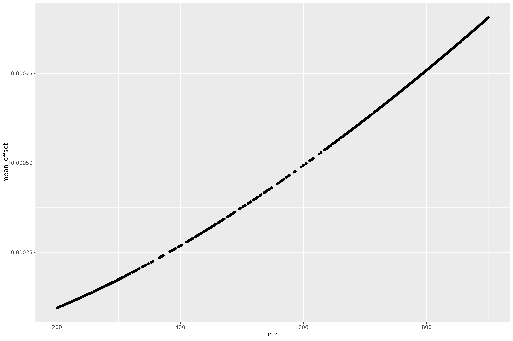

<!-- README.md is generated from README.Rmd. Please edit that file -->

# ScanCentricPeakCharacterization

The goal of the ScanCentricPeakCharacterization package is to facilitate
scan-centric peak characterization of profile level, multi-scan,
direct-injection Fourier-transform mass spectrometry data.

You can read more about the merits of this scan-centric method in:

RM Flight, JM Mitchell & HNB Moseley, “Scan-Centric, Frequency-Based
Method for Characterizing Peaks from Direct Injection Fourier transform
Mass Spectrometry Experiments”, bioRxiv, doi:
<https://doi.org/10.1101/2022.04.14.488423>

## License

This package is licensed with a [BSD-like license](LICENSE.md) with a
4th clause: No commercial use.

Academics who want to use it at their institution, please try it.

If you are at a business / for-profit and want to use it, please contact
the authors about licensing. Please contact us even if you aren’t sure
what would be required for licensing, we do want people to use it.

## Installation

You can install ScanCentricPeakCharacterization from
[GitHub](https://github.com/) with:

``` r
# install.packages("remotes")
remotes::install_github("MoseleyBioinformaticsLab/ScanCentricPeakCharacterization")
```

## Setup

``` r
library(ScanCentricPeakCharacterization)
library(dplyr)
library(patchwork)
library(ggplot2)
theme_set(cowplot::theme_cowplot())
```

## Theory

### Converting m/z to Frequency

Outside of the scan-centric nature of this peak-characterization, the
second most important feature is the conversion from m/z to frequency.
This is done to make evenly spaced data. If you acquire Orbitrap / ICR
type mass spectrometry data over any decent range, their is an
increasing spacing between individual m/z points.

We will load up an example direct-injection lipidomics sample acquired
on a Thermo-Fisher Fusion instrument to demonstrate.

``` r
raw_lipid = SCRaw$new(system.file("extdata/lipid_example.mzML", package = "ScanCentricPeakCharacterization"))
raw_lipid$extract_raw_data()
raw_lipid$predict_frequency()
```

``` r
raw_lipid$raw_df_data[[1]] %>%
  dplyr::filter(convertable) %>%
  ggplot(aes(x = mz, y = mean_offset)) +
  geom_point()
```



We can see here that the difference or offset of m/z points is
increasing with m/z.

In contrast, frequency is defined as the difference over m/z, and
therefore is constant.

")


``` r
raw_lipid$raw_df_data[[1]] %>%
  dplyr::filter(convertable) %>%
  ggplot(aes(x = mean_frequency, y = mean_freq_diff)) +
  geom_point()
```


However, we can more generally define the conversion of m/z to frequency
using a linear model of the form:

![frequency = a + \\frac{y}{\\sqrt{mz}} + \\frac{z}{\\sqrt\[3\]{mz}}](https://latex.codecogs.com/png.image?%5Cdpi%7B110%7D&space;%5Cbg_white&space;frequency%20%3D%20a%20%2B%20%5Cfrac%7By%7D%7B%5Csqrt%7Bmz%7D%7D%20%2B%20%5Cfrac%7Bz%7D%7B%5Csqrt%5B3%5D%7Bmz%7D%7D "frequency = a + \frac{y}{\sqrt{mz}} + \frac{z}{\sqrt[3]{mz}}")

And we can verify that with a plot of the m/z vs frequency and their
predicted values, in a couple of ways, as well as a plot of the
residuals.

``` r
raw_lipid$check_frequency_model()
```


See the example of `SCRaw` below to see how we can change the model
being used.

## Basic Objects and Classes

### SCCharacterizePeaks

`SCCharacterizePeaks` controls the overall interplay between:

-   the `SCZip` container that will hold the original and final data;
-   the `SCRaw` object that loads raw data, transforms it to frequency
    space, and filters out scans that don’t seem to belong;
-   the `SCPeakRegion` and `SCPeakRegionFinder` that actually do all of
    the peak characterization.

It also has the ability to do the first preparation steps of the data
and check that the frequency model is appropriate.

Let’s give an example using an example lipid file.

``` r
lipid_sample = system.file("extdata", "lipid_example.mzML", package = "ScanCentricPeakCharacterization")
sc_char = SCCharacterizePeaks$new(lipid_sample, out_file = here::here("lipid_sample.zip"))

sc_char$load_file()
sc_char$prepare_raw_data()
```

#### Check Frequency Model

And now we can check that our frequency model should work for the rest
of the steps.

``` r
sc_char$check_frequency_model()
```


If the frequency model was wrong, then we should instantiate a new one
with a different model.

``` r
freq_model2 = c("a.freq" = 0, "x.freq" = -1, "y.freq" = -1/3)

sc_char2 = SCCharacterizePeaks$new(lipid_sample,
                                   frequency_fit_description = freq_model2)

sc_char2$load_file()
sc_char2$prepare_raw_data()

sc_char2$check_frequency_model()
```


Yeah, this model is definitely incorrect

#### Check Scans Kept

We can also check which peaks were excluded by examining the `scan_info`
data.frame.

``` r
scan_info = sc_char$scan_info()
head(scan_info)
#>   scanIndex scan polarity      rtime       tic
#> 1         1    1        1  0.8358959 429046848
#> 2         2    2        1 11.8961766 282278784
#> 3         3    3        1 22.9689818 439026304
#> 4         4    4        1 34.0144615 429789920
#> 5         5    5        1 45.0615118 433693216
#> 6         6    6        1 56.1078670 429844288
#>   rtime_lag rtime_lead        mad    a.freq   y.freq
#> 1        NA   11.06028 0.09352387 -15.89917 29802574
#> 2  11.06028   11.07281 0.10655177 -16.55300 29802529
#> 3  11.07281   11.04548 0.08979585 -15.58041 29802588
#> 4  11.04548   11.04705 0.09670872 -15.63290 29802583
#> 5  11.04705   11.04636 0.09536132 -15.69517 29802578
#> 6  11.04636   11.04656 0.09531087 -15.61509 29802583
#>     z.freq        a.mz      x.mz         y.mz
#> 1 370.9857 0.003203856 -19081.56 8.882685e+14
#> 2 389.1065 0.003874297 -22330.45 8.882729e+14
#> 3 363.6677 0.002996038 -18154.25 8.882673e+14
#> 4 365.7213 0.004465065 -24589.24 8.882763e+14
#> 5 366.6184 0.003222591 -19116.27 8.882683e+14
#> 6 365.5528 0.004144753 -23243.80 8.882745e+14
#>            z.mz rtime_keep y_freq_keep stats_keep
#> 1 -1.900395e+16       TRUE        TRUE       TRUE
#> 2 -2.130416e+16       TRUE        TRUE      FALSE
#> 3 -1.836750e+16       TRUE        TRUE       TRUE
#> 4 -2.247840e+16       TRUE        TRUE       TRUE
#> 5 -1.894065e+16       TRUE        TRUE       TRUE
#> 6 -2.166934e+16       TRUE        TRUE       TRUE
#>    keep
#> 1  TRUE
#> 2 FALSE
#> 3  TRUE
#> 4  TRUE
#> 5  TRUE
#> 6  TRUE

scan_info %>%
  ggplot(aes(x = rtime, xend = rtime, y = 0, yend = tic, color = keep)) +
  geom_segment()
```


We can see that several scans were excluded by being too high in their
retention time (rtime), and then two were outliers based on the
statistics of the frequency square root coefficient.

If this isn’t doing what we want, we can define a different
scan-filtering function that does more along the lines of what we want.
See the documentation about `get_scan_info()` using `?get_scan_info` to
see what is generally available.

#### Run Peak Characterization

Once we are happy with how we have set up the `SCCharacterizePeaks`
object, we can run the peak characterization.

``` r
# not run
sc_char$find_peaks()
```

#### Run Everything

If you’ve already examined the model, and have your function for
filtering scans all set up, then you can run everything on your sample
rather quickly using this simple command:

``` r
# not run
sc_char = SCCharacterizePeaks$new("file.mzML", out_file = "file.zip")
sc_char$run_all()
```

### SCRaw

`SCRaw` is responsible for loading the raw data, holding per-scan
metadata, extracting the scan-level m/z and intensity, converting them
to frequency, and filtering any scans out. Although the user should not
have to interact with it much, and **normally** it is controlled by
`SCCharacterizePeaks`, we cover it first here b/c it is useful to
instantiate it at least once per experiment and verify the scan
filtering conditions and the model for converting m/z to frequency.

The default frequency \~ mz model is defined as:

![frequency = a + \\frac{y}{\\sqrt{mz}} + \\frac{z}{\\sqrt\[3\]{mz}}](https://latex.codecogs.com/png.image?%5Cdpi%7B110%7D&space;%5Cbg_white&space;frequency%20%3D%20a%20%2B%20%5Cfrac%7By%7D%7B%5Csqrt%7Bmz%7D%7D%20%2B%20%5Cfrac%7Bz%7D%7B%5Csqrt%5B3%5D%7Bmz%7D%7D "frequency = a + \frac{y}{\sqrt{mz}} + \frac{z}{\sqrt[3]{mz}}")

We encode this using the vector:

``` r
freq_vector = c("a.freq" = 0, "y.freq" = -1/2, "z.freq" = -1/3)
freq_vector
#>     a.freq     y.freq     z.freq 
#>  0.0000000 -0.5000000 -0.3333333
```

We can see how this corresponds to the equation above if we transform
the equation to be like this:


Here we use the **-** to define that it should be a fraction, and the
**1/2** exponent corresponds to the square root.

This is the **default model** that `SCRaw` is instantiated with. But
every time you work with a new dataset, you should verify the model
being used is appropriate.

``` r
lipid_1 = SCRaw$new(system.file("extdata", "lipid_example.mzML", package = "ScanCentricPeakCharacterization"))
lipid_1$extract_raw_data()
lipid_1$predict_frequency()

lipid_1$check_frequency_model()
```


So this model looks right.

What if we mis-define the model?


``` r
alt_model = c("a.freq" = 0, "x.freq" = -1, "y.freq" = -1/3)

lipid_2 = SCRaw$new(system.file("extdata", "lipid_example.mzML", package = "ScanCentricPeakCharacterization"),
                    frequency_fit_description = alt_model)
lipid_2$extract_raw_data()
lipid_2$predict_frequency()

lipid_2$check_frequency_model()
```


Here we can see in the residuals (mean\_predicted) that we’ve obviously
mis-defined the model. It’s not obvious from the means vs predictions
that we’ve mis-defined it!
